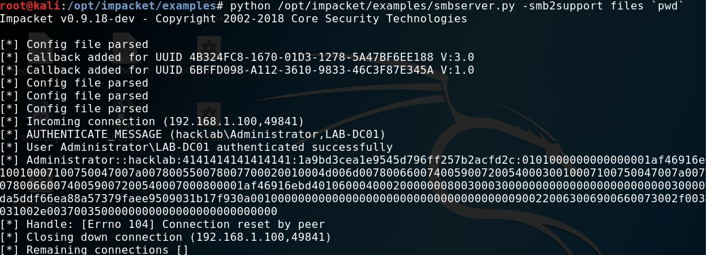

  

***

A while back Darren Mar-Elia tweeted about sending gpos down the wrong path.
 

 
You should read <a href="https://sdmsoftware.com/group-policy-blog/security-related/sending-gpos-down-the-wrong-track-redirecting-the-gpt/" target="_blank">his article</a> before we move on here.

After I was done I thought: "If an attacker can redirect the GPO to a SMB-Share, shouldn't he be able to use tools like impacket's SMB-Server to
capture all the NTML hashes in a domain? Let's try that.

My setup contained a simple domain with one Domain Controller, User and Client. For the attacker-machine I used my Kali Linux.
I started impacket's SMB-Server and pointed the GPO to it by changing "gPCFileSysPath".

Then I tried to view the GPO-Settings again and indeed got the NTLM Hash of the Domain-Admin.

The next thing I focused on was the behavior of the clients / users that get the GPO. Will they sent us the hash aswell?
Well - in my short test I wasn't able to get any user hashes - but the Computer-Account as seen in the picture after issuing a gpupdate /force.
The same would happen on a reboot.

I searched for attacks someone could pull of with the Machine-NTLM-Hash and found those:

<a href="https://blog.secarma.co.uk/labs/using-machine-account-passwords-during-an-engagement" target="_blank">blog.secarma.co.uk</a>
 
<a href="https://adsecurity.org/?p=2753" target="_blank">adsecurity.org</a>

This attack-vector might be of limited use because you need write-access to the GPO in the first place. But it was a nice and simple research project for
me.

Take care!

x41
