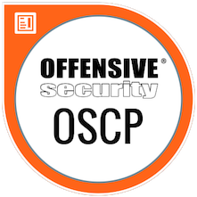

  

***

# Introduction
I think everybody expects some kind of experience-report after getting the "OSCP certification". So this is my take on this.
Before I dive in - please keep in mind:

I will only describe how I approached the "PWK course" and "OSCP certification".

`THIS MIGHT NOT WORK FOR YOU!`

With this out of the way, let's dive right in.

[[Top]](#top)

# Pre-Enrollment
My journey started a long time before actually enrolling in the exam in 2019.
In fact, everything I've done at work and at home lead to this.

I knew years ago that I wanted to shift from a windows sysadmin and active directory architect role into a position in infosec.
With this goal in mind I did an inventory of my skills. What do I know? What do I think I need in infosec?
And where are my skill-gaps?

One of thoses gap were: I wasn't able to code in python. Why python? Because a lot of infosec-tools and exploits
are written in python. Surfing on Exploit-DB or Youtube and watching people do stuff helped to get a feeling for this and other gaps.

Long story short: I bought a python3 book and started learning and coding.
I challenged myself on CTF sites which improved my coding a lot as well as other topics in infosec. 

This process was repeated for other areas aswell. Exploit-Development, Metasploit-Usage, using Linux as my main OS.
I started hosting my own mail and webserver. Which also taught me a lot about Linux and how it works. It made me a better sysadmin too.

All this started even before 2008. Twelf years ago.

Around 2017 I discovered HackTheBox and was hooked right away. I did some of the challenges because I was familiar with that type of CTF.
Some weeks (or months) later, I popped my first box on HTB and sucked up every bit of knowledge I was able to get my hands on.

Chipping away on my skill-gap one box and one challenge at a time. At the beginning of 2019 I felt the need to take this a bit further.
I had to get the OSCP certification to advance my career.

In mid 2019 I started with some hands on exploit development exercises. Prior to that - everything I did was just theoretical.
It wasn't too difficult to be honest. I had some problems to get started though. A result of my learning style. I need to
do things "my way" to understand what's going on. "My way" is often "the hard way" and also "might not even work". But the benefit
for me is, after failing - I know why I failed. 

I finished the stack overflows right when HTB release the box "Safe". An easy rated box with an exploit to gain inital access. 
But I failed solving it. Well - it was not a OSCP style stack overflow without protections. 
It had DEP enabled - which ment I had to create a ROP chain. I had never done that.

So I tought myself some rop techniques on "ROPEmporium" over the course of a couple of weeks. You can read more of that
in my <a href="https://www.tagnull.de/post/safe/" target="_blank">Safe - Writeup</a>.

After doing all that I called my wife over. Together we spent some time discussing when the course and exam would fit into our calendars. 
This is really important. The course will take a lot of your spare time. Make sure your loved ones are able to support your journey. 

Once that was out of the way - I enrolled for the course in November 2019. Start of the course was scheduled for the beginning of January 2020.
I booked 60 days of lab time. I felt rather confident that this would be sufficient and 90 days would have collided with my wifes plans for april.

[[Top]](#top)

# The Course
So the course started in January 2020. I had three weeks of vaccation left and I used them wisely.
Which means, like in my previous years of learning, have a fucking goal in mind. What do you want to achieve?
Where are your skillgaps in relation to your set goals and the OSCP exam? Read the "OffSec FAQ" on the Exam 
and mark things you've never done before. For me, pivoting was one of those things.
I knew basically what I had to do, but that's not enough. Hands on is the only way to know you can do something.

So my inital goals for the lab were:

* Get a foothold in every network present in the lab
* Compromise at least 2 boxes in each of those networks
* Get Domain-Admin access
* Do some of the "Big 4" machines

These goals changed every now and then. Don't be afraid of changing your goals when you find they don't align with your set goals anymore.

For example, I started with the mindset of NOT doing the exercises in the course-pdf. Then I started doing them. Then I stopped doing them.
Do what feels right for you to reach your goals.

At the end, I didn't do any of the exercises and didn't file a lab-report. Mainly because for me it was a waste of time. I only had 60 days
of lab time to begin with, and 5 points extra wasn't a great incentive to spent 3 weeks on this task. For you, it might be time well spent.
Or in other words, this task wasn't in alignment with my goals.

I took breaks every couple of days. Those days were either family days or a video / pdf day. But never a lab day. Your brain needs to
cool off. Take breaks. 

There will be ups and downs, good and bad days - those are normal.
Don't freak out - you can do this.

[[Top]](#top)

# The Exam
I reached all of my set goals within those 60 days. And those 60 days went by really fast. 
After my lab time expired, I had 2,5 days till my exam. I used one day to go over my notes and update the cheat-sheet I made with
the commands I used in the past weeks.

By going over it I also refreshed my mind of techniques used at the very beginning of my lab time. Who knows what comes up
in the exam, right? Last but not least I did two of the training exploits again. I hadn't done them for weeks and a quick 
refresher was due.

For exam-day my wife and I planned that I will have the house for myself for the weekend. So I had over 48 hours of absolute silence to do the exam.
I can assure you, I would have failed the exam without that. You need to be able to rest and focus.

The exam started at 14:45 with the proctor asking me to show my room and going through their checklist.
This was straight forward and no technical or other issues were found. However, I was so fucking nervous that it took
me like 8 minutes to get the VPN file onto my Kali Box because copy and paste was broken! After wasting precious time, I got the green light
to proceed.

I started with creating notebooks for the machines. Just some plumming work I always do. 
Then went straight for the bufferoverflow box in the exam. It was the right choice for me, because I was so freaking nervous. 
The bufferoverflow process OffSec teaches you is very straight forward. Once you know the steps and practiced them, 
you don't have to think much. This helped me getting over my anxiety.

I am not sure how long it took me to finish the machine. I guess between 40 and 60 minutes. 
The other 25 point box was my next target. But I couldn't get in. So I changed my plans after some time and attacked other machines.
Around 01:00 and nearly 10 hours into the exam I went to bed. At this point I had not enough points to pass yet. But I was really close.

As I went to bed my head was spinning. I had a strange sensation of hearing all sounds around me at once - like without a filter.
I was definitely done for the day. My alarm clock was set for 06:00. Only 5 hours of sleep.

After 3,5 hours of sleep (probably just one REM-Cylce ;D) I woke up and had to get back into the exam. A hot shower and a coffee 
later, I proceeded.

Around 10:00 I had more than enough points to pass the exam. 4,5 boxes owned. Only the the privesc on the 25 point box was left to do.
I stopped hacking and did a reset on all boxes. Then, I went over my notes and all the exploitation steps needed for each box.
Took some screenshots that were missing and ran my buffer-overflow exploit one more time to checked if it would still work. 
Also I checked that all the flags I found were present in my notes, in the screenshots and in the dashboard. 

**CHECK! EVERYTHING!**

After that I went back to the privesc. But I wasn't able to get something usefull out of it till the end of my exam time.
That was it. The exam was over. But then, it hit me...

[[Top]](#top)

# The Report
After all that, I still wasn't finished. I had to write a report. It was really hard to motivate myself to push on.
And time was already ticking. I tried to catch some sleep, but just ended up taking a 2,5 hour break before starting the report.

My toolchain for documenting the lab and writing the report worked out great. I might do a seperate blog post on how to set
everything up the way I had it. But in a nutshell I used Joplin for my notes. Everything I did was in Joplin.
It's one of the best markdown tools for taking notes in my opinion. Setup cloud sync with nextcloud and you don't have to
be afraid of losing your progress.

The report was written in markdown and then converted to a PDF with pandoc. 
To make the report pretty I used the <a href="https://github.com/Wandmalfarbe/pandoc-latex-template" target="_blank">Eisvogel Latex-Template</a>.
It's quite a hefty setup. But also very powerful and easy to handle. Worked better than LibreOffice or Word for that matter. At least for me.
John Hammond did a video on this setup too.



The only thing that was quite a pain, was writing my report with nano. I probably would switch to a graphical editor like VSCode.
I didn't use Joplin for the report because for this task, it would have slowed me down.

It took me about 10 to 12 hours in total to finish my report. I triple and quadruple checked everything again. Flags? Screenshots? 
All commands correct? Appendix? Is everything there? Does the password for the 7z archive work? It works. Try again. Ok it still works.
But try again - just one fucking more time. Then turn the report in. Done. 

7 days later, I got the sweet sweet email from OffSec. I passed! :)

[[Top]](#top)

# Tips

- Talk to your loved ones, you'll need their assistance!
- Identify your `skill-gap`
- `Define goals` for your lab-time and close your skill-gap
- Take notes and create your `personal cheat-sheet`
- Take more screenshots than me ;)
- Take breaks
- Keep calm and `\xFF\xE4`
- Try harder! ;)

Good Luck!

x41

[[Top]](#top)