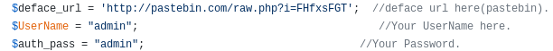
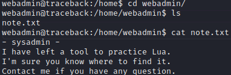
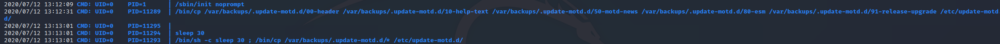
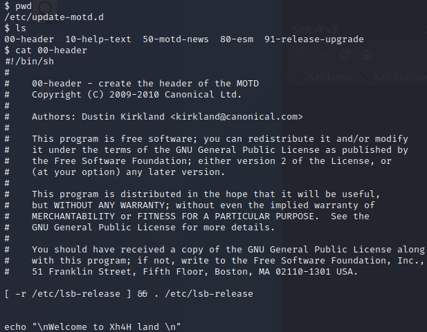

  

***

# External Recon

Welcome to my first box and writeup since my OSCP. 
We start with a nmap scan as usual:

# Website

Checking the website it seems like somebody already defaced the website.

We find a little hint in the sourcecode.

A google search on "webshells + Xh4H" reveals a [github repository](https://github.com/Xh4H/Web-Shells)
with a bunch of webshells. And sure enough we try all of them on our target.

The `smevk` webshell works!

Checking the github repository for credentials reveals `admin:admin` in the config.

After logging in the next step was to upload a propper [php-reverse-shell](https://github.com/pentestmonkey/php-reverse-shell) to get some sane control over the machine.

I created a `nc` listener on `port 9001` and called the reverse-shell via the browser.

# User PrivEsc

As seen in the above screenshot, we have `webadmin` permissions. So let's go and check his home directory.

The user `Sysadmin` left a note about a tool `webadmin` might want to practice with.
Running `sudo -l` leaked the tool in question and the info that we can run it without the password from `Sysadmin`.

Futher investigation reveal more useful information. In the history-file you can see how the command was used by the attacker that defaced the box.

It looks like a `.lua` file is needed and can be passed as an argument to the `luvit` tool from "sysadmin". I checked the [gtfobins website](https://gtfobins.github.io/gtfobins/lua/) to see what I can do with lua. 

After creating a file with `os.execute("/bin/bash")` as content and naming the file `privesc.lua`, I was able to privesc to `Sysadmin` and capture the user flag.

# Enumeration of Sysadmin

With the new privileges at hand I uploaded two of my goto tools to the system. `LinPEAS` and `pspy64`. Neither disappoint in this scenario.
I sifted through the `LinPEAS` output and found some very promissing information.

Pspy64 confirmed that something is about the `motd` (motto-of-the-day) files as they are constantly restored by a cronjob.

Before we move on to root the box I went and created an ssh-key for sysadmin to get a better and more stable shell. After logging in I noticed
the custom banner from the initial attacker. 

# Root

So after enumerating the Sysadmin-User I checked the motd files. The `00-header` file was particilar interessting.

If you check the very last line you can see that it's the same we saw after using our ssh-key for Sysadmin.
The privesc path should be clear at this point. 

The motd files are essentially bash-scripts and Sysadmin can edit them. But they are run by root once you log in via ssh.

So I appended a reverse-shell to the `00-header` file and had a listener ready to capture the shell. 
As we know through our enumeration, the file will be restored every couple of seconds. So we need to be quick.

Append the shell, login as Sysadmin and capture the shell.

Easy as that. :) 

See you in a bit!

x41

