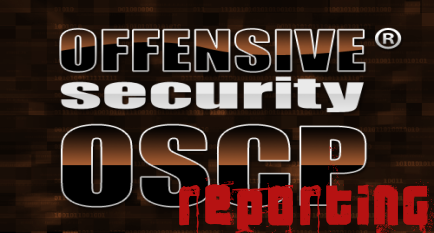
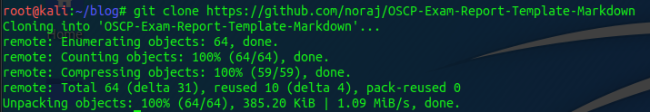
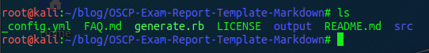
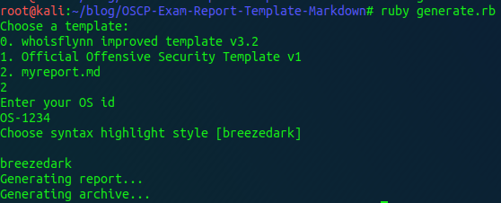
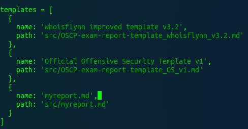
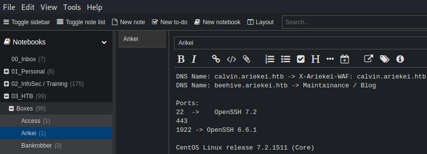
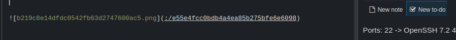
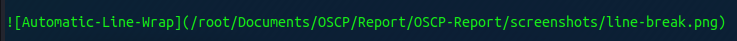
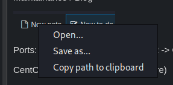
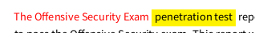

  

***

# Introduction

I had to write a report for the OSCP exam and I was asked to explain my personal setup and the process of writing
the report.

# Setup all the things

First we need to install the following tools:

1. Joplin (optional)
2. Latex
3. Pandoc
4. Eisvogel Latex Template
5. Noraj Markdown OSCP Template

## Install Joplin

Depending on your operating system you need to use a different installer.
Just go to [Joplin.org](https://joplinapp.org/) and follow the instructions for your scenario.

## Install Latex

To install Latex on Kali Linux I followed this "guide" on [StackExchange.com](https://unix.stackexchange.com/questions/217564/how-to-install-texlive-full-on-kali-linux).
I was also very lazy and just installed <kbd>texlive-full</kbd> because I didn't spent time on figuring out which packages our template uses.
But be aware, <kbd>lexlive-full</kbd> is about 5 GB in size.

## Install Pandoc

Next on our list is <kbd>pandoc</kbd>. They do have a guide on how to install it and build it from source on their website.
If that's your way of doing things, go there and read the docs. But I like to use the package manager of my OS to deal with
installing software. So a 

* `apt update; apt install pandoc` 

should do the trick.

## Install Eisvogel Latex Template

First get the latex template:

* `git clone https://github.com/Wandmalfarbe/pandoc-latex-template`

After cloning the repository, move the template eisvogel.tex to your pandoc templates folder and rename the file to eisvogel.latex. The location of the templates folder depends on your operating system:

- Unix, Linux, macOS: /Users/USERNAME/.local/share/pandoc/templates/ or /Users/USERNAME/.pandoc/templates/
- Windows Vista or later: C:\Users\USERNAME\AppData\Roaming\pandoc\templates\

If there are no folders called templates or pandoc you need to create them and put the template eisvogel.latex inside. 

I suggest reading through the github repo yourself. "Wandmalfarbe" has some examples online and you might get some usefull insights out of it.

### Install Noraj OSCP Template and using Eisvogel

I don't like redoing things that other already did better than me.
A google search revealed noraj's template.

Clone noraj's repo:

* `git clone https://github.com/noraj/OSCP-Exam-Report-Template-Markdown`

Looking into the repo take note of the following elements.

- generate.rb
- src
- output

The generate.rb script will do the heavy lifting for you. It will consume a markdown file from your src directory (or any other dir)
and creates a pdf file out of it. The Eisvogel Latex Template is used to make it pretty.
It also creates a 7z file with your OS-ID as the password.

In the src directory you find two markdown-template files. Pick the one you like best. I used the "whoisflynn" template.
I suggest to make a copy of the template and leave the original intact. If you do so and work with a copy you'll need to edit the generate.rb ruby script 
and include the new file. Same when you host your files in a custom report directory.

Now you can start writing your own report and make changes rather quickly. Without having to mess with strange formating crap that word or libreoffice
are constantly throwing at you.

For more details on the usage, visit the repo and check the README.

## My Workflow

### Notebooks, Sub-Notebooks and Notes

So, I told you to optionaly install Joplin. This is only needed when you are not already invested in a different tool for taking notes.
I use Joplin for quite a while now and love it. So here's my way of using it in the exam.

To take notes I created notebooks and sub-notebooks in Joplin for each machine in the exam. I leave it to you to find a propper stucture.
But as a reference on how it could be done, here's an example of one of my HackTheBox notes:

### Screenshots

One thing that you also need to document are screenshots.
Whenever I took a screenshot I copied into my clipboard and pasted it in my notes. Joplin will automatically create a markdown link and save it in it's
own directory.

After taking the exam, I used the notes to populate the report template and create placeholders for the screenshots.
As an example, you can keep something like this in your clipboard: 

- ``

For "x" I included a meaningfull filename and discription.

Once done writing the report you could generate it. But it will fail as is right now - because the path and images for the screenshots doesn't
exist at the moment. So create the directory you used as the placeholder. Next you need to populate that folder. 

To do so, open Joplin and right click on one of the images you dumped in there and you'll get a "save as" option. 
Now you can save it in your screenshot folder and give it the same name you used in your report.

To make this process of going back and forth quicker, I used a different tool for writing my report than taking my notes. As you might know
I used nano. Which I can't recommend. Use VSCode, Sublime or whatever works for you. The key element for me was to use two seperate tools.
Have them next to each other so you can scroll through your report until you find a screenshot-placeholer, tab over to Joplin, save the image
to the preset folder, give it the name and repeat that.

When you generate your final report now and you missed one screenshot or fat fingered the name, the generation will fail and you get an error.
Which is great because you can fix it and can make sure all screenshots are in your report.

### Colors

You can use latex commands in your markdown file too. 

To change the font color do:

- `\textcolor{red}{CRITICAL}` 

To highlight some text do:

- `\colorbox{yellow}{Important-Text}`

Play with this a bit before taking the exam. Maybe write a sample report with a couple of lab machines. But that's up to you.
Please make sure you read the OffSec FAQ and check if this guide still applies to your exam. They do change things.

And that's basicly it.

Have a nice day!

x41